# Series 1: Dive Into Docker

## Video 1: Why we use docker

- Installing software on your computer (locally)
- Docker solves that problem
- Really easy and straightforward to run software any given computer (or any cloud based computing platform) without having to do any setup and worrying about dependencies

## Video 2: What is docker

- Docker itself is a platform or ecosystem around creating and running contianers (when someone talks about docker they are usually talking about the this ecosystem)

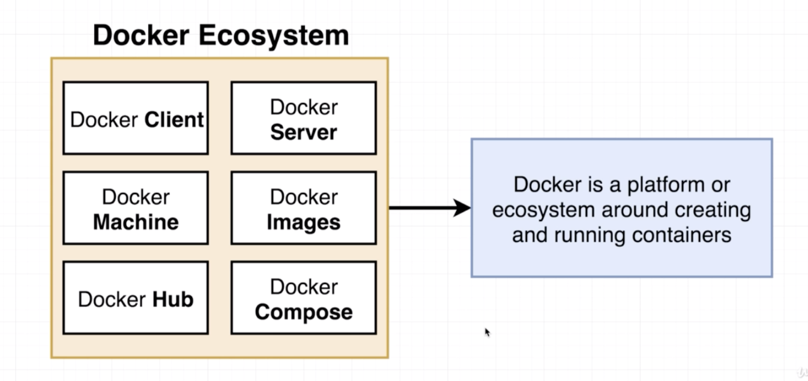

- Tools that come together so create a platform

### What is a container

- Image: Single file with all of dependencies and config required to run a very specific program (file gets stored on your hardrive)
- Container: Is an instance of an image (think of it as a running program), also a program of its own isolated set of resources (own space of memory, hardrive space, own space for networking)

## Video 3: Docker for windows/mac

- When installing docker for mac/windows we install two pieces
  1. Docker Client: Used to run commands in the terminal
  2. Docker Server: (Docker Daemon) tool that is repsonsible for creating images, running containers etc.

## Video 4: Installation MacOS

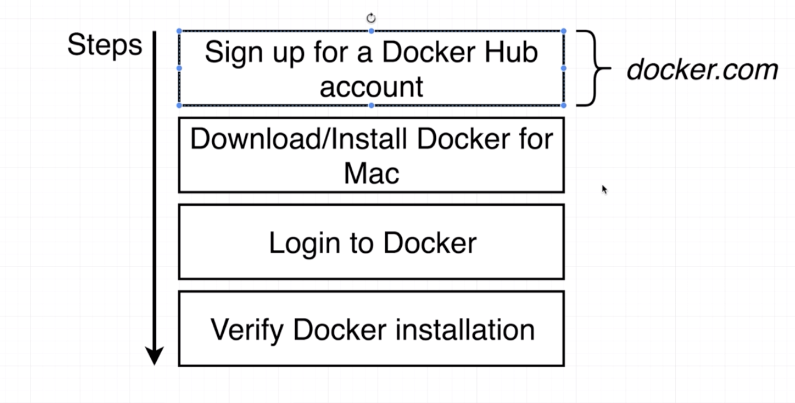

## Video 10: Using Docker Client

Ex. What happens when you run `docker run`

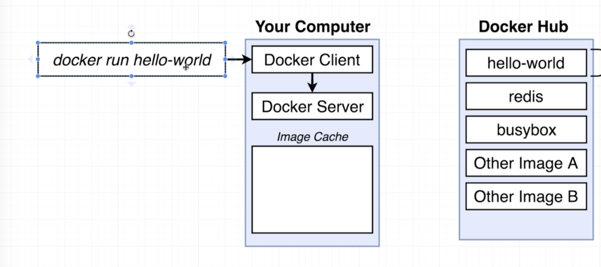

- Starts up the docker-cli
- Communicating the commands to the docker server (charge of heavylifting)
- Docker server saw we were starting a new container called `Hello World`
- Docker server checks the image cache (locally) to see if the image exists
- Docker hub free docker images that you can download on your computeri

## Video 11: But Really what is a container

- Inorder to understand how a container is running on your computer you first need to understand how the underlying OS works

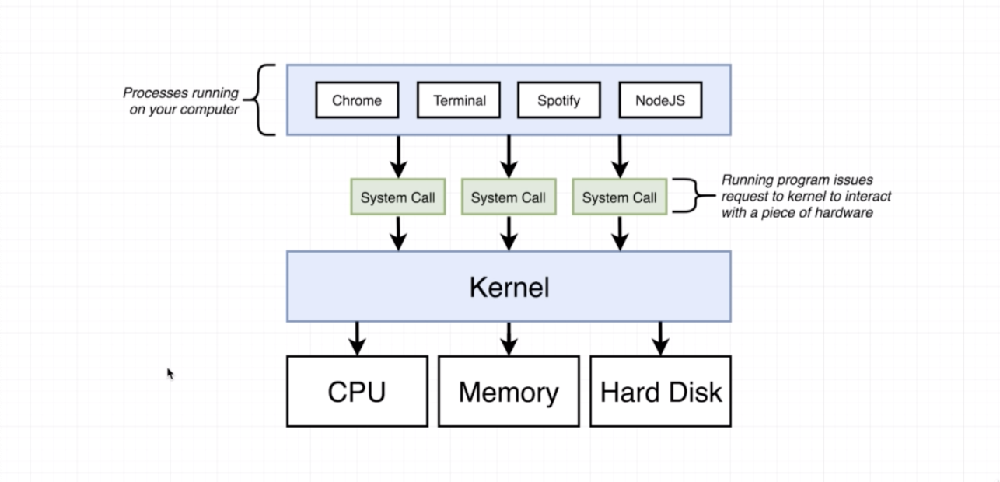

- Kernel: A running software process that governs access between programs that are running on your computer and all the physical hardware that is connected to your computer
- System Call: A way for the running programs to issue requests to the kernal and interact with a piece of hardware (function invocations, kernal says if you want to use this piece of hardware here is an endpoint or call this endpoint right here)

Example Situaion (make believe)

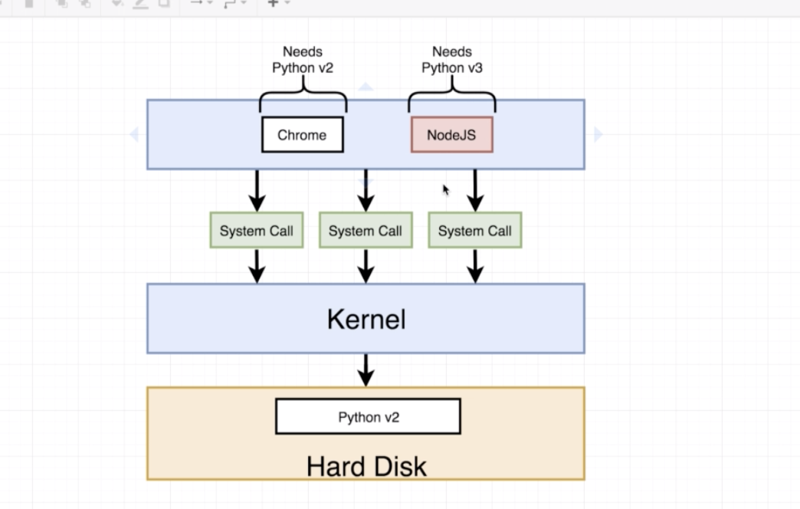

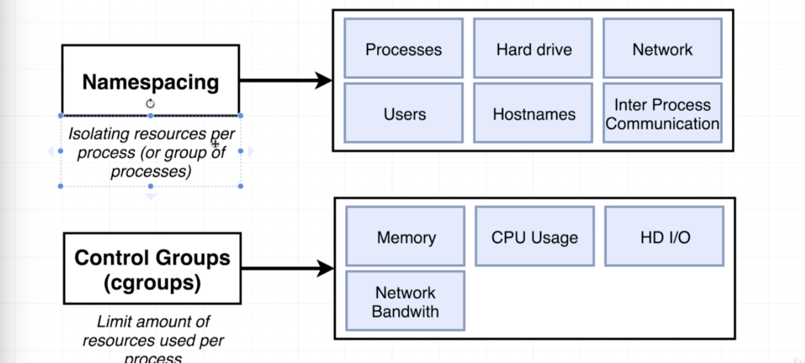

- Namespacing: segement out portion of the resources (some use pv2 and some use pv3)

  - Isolating resources per process (or group of processess)

- Control Groups: Limit amount of resources used per process

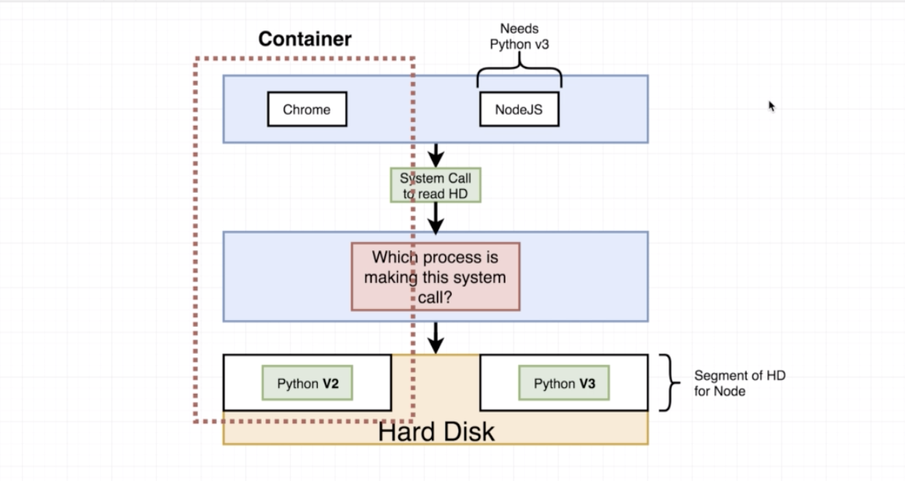

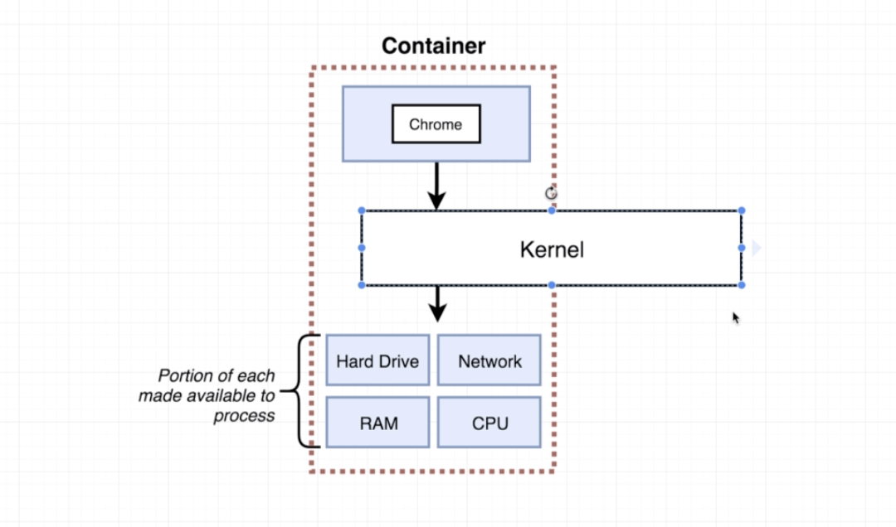

- Set up of processes that has a grouping of processess assigned to it

### What is the relation between image and container

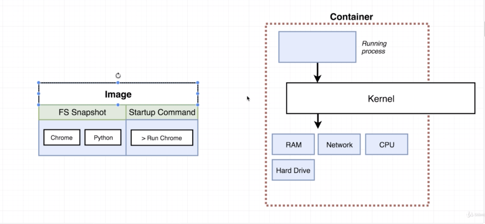

- Image: fs snapshot

## Video 12: How Docker is running on your computer

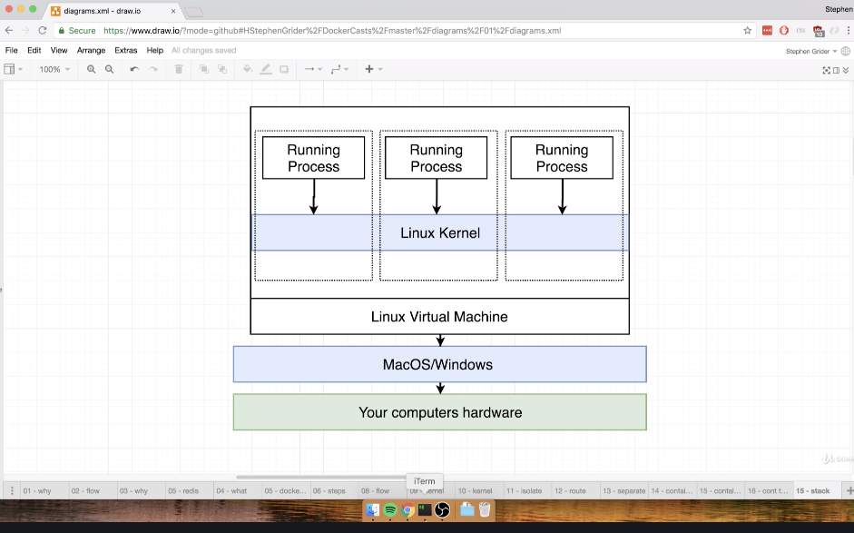

- Basically when you start up docker it runs a linux virtual machine and you can see the virtual machine by running the command `docker version` and looking at the OS/Linux line

# Series 2: Manipulating Containers with the Docker Client

## Video 1: Docker Run in Detail

- When we run the command `docker run hello-world` it tries to find the image locally if it cannot it will pull the image from docker-hub and docker will create a container with the isolated resources to run the program (see image below for container example)

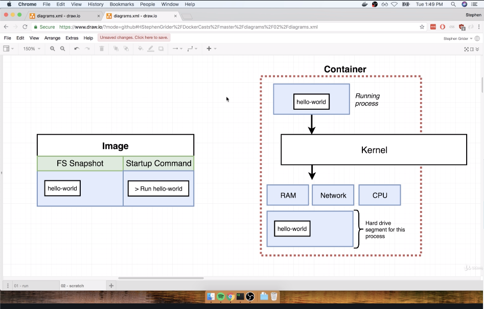

- FS: filesystem

## Video 2: Overiding Default Commands

- `docker run busybox echo hi there`: echo hi there -> is known as the default command overide
- `docker run busybox ls`: returns folders that are in the container
- We use busybox b/c `ls` and `echo` programs exist in the busybox container folder, the hello-word program does not contain any of those folders

## Video 3: Listing Runnning Containers

- `docker ps`: lists all running containers, also running this command will display the id of the container
- As of right now we have been running containers that run and shut down immediatly

## Video 4: Container Lifecycle

- Creating a container and starting a container are two different processes
- `docker run` = `docker create` + `docker start`
- `docker create` returns the id of the container
- `docker start -a docker create hello-word` (-a watches the output and prints to the terminal)
- `docker run`-> shows output, `docker start` does not

## Video 5: Restarting Stopped Containers

- When a container is exited you can still start it back up, by taking the id and running `docker start <id>`

## Video 6: Removing Stopped Containers

- `docker system prune`: deletes stopped containers, deletes build cache (going to have to redownload images from docker hub) shows diskspace that was reclaimed

## Video 7: Retrieving log outputs

- `docker logs <container id>`: shows log output, good way to inspect the container and see whats going on

## Video 8: Stopping Containers

- `docker stop <id>`: stops running container (run SIGTERM, gives it time to shutdown and cleans up the process)
- `docker kill <id>`: kill the running container (runs SIGKILL, means you have to shut down right now and no additional work)
- If `docker stop` does not work within 10 seconds it will automatically run `docker kill`

## Video 9: Multicommand Containers

## Video 10: Executing Commands in Running Containers

- `docker exec -it <id> <command>`: lets us exec into the container
- Ex. `docker exec -it <id> redis-cli`

## Video 11: The Purpose of IT Flag

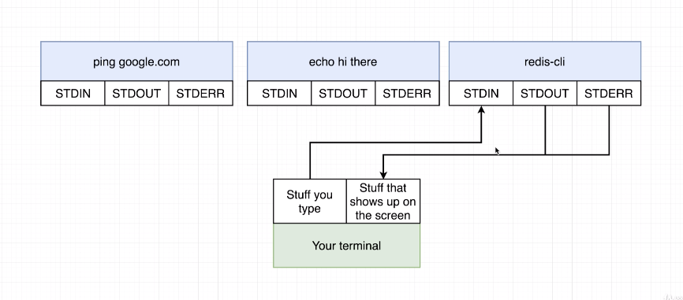

-i: attatching to the STDIN (standard in)
-t: all the text comes out in a nicely formatted way

## Video 12: Getting Command Prompt in Container (Open up terminal in docker container)

- `docker exec -it <id> sh`: exec into shell (type commands in Unix env.) -> good for debugging

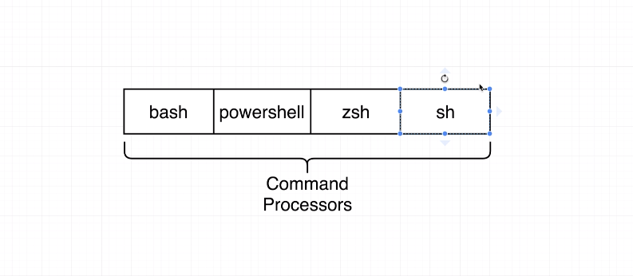

## Video 13: Starting with Shell

## Video 14: Container Isolation

# Series 3: Building Custom Images Through Docker Server

## Video 1: Creating Docker Images

- To create a docker image (Dockerfile -> Docker Client -> Docker Server -> Usable image)
- Dockerfile: Flow
  1. Specify Base Image
  2. Run some commands to install additional dependencies
  3. Specify a command to run on container start up

## Video 2: Building Dockerfile

- Goal: Create an image that runs redis-server

## Video 3: Dockerfile Teardown

- Look at Dockerfile in redis-image dir.

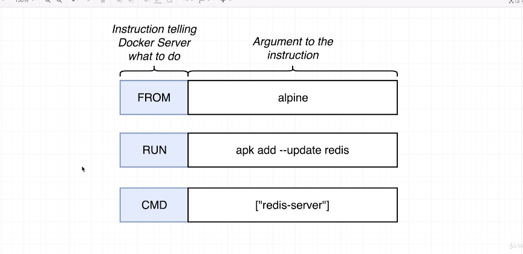

## Video 4: Whats a Base Image/Build Process in Detail?

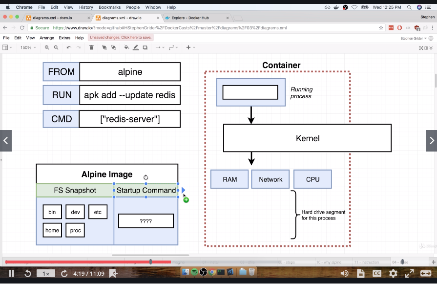

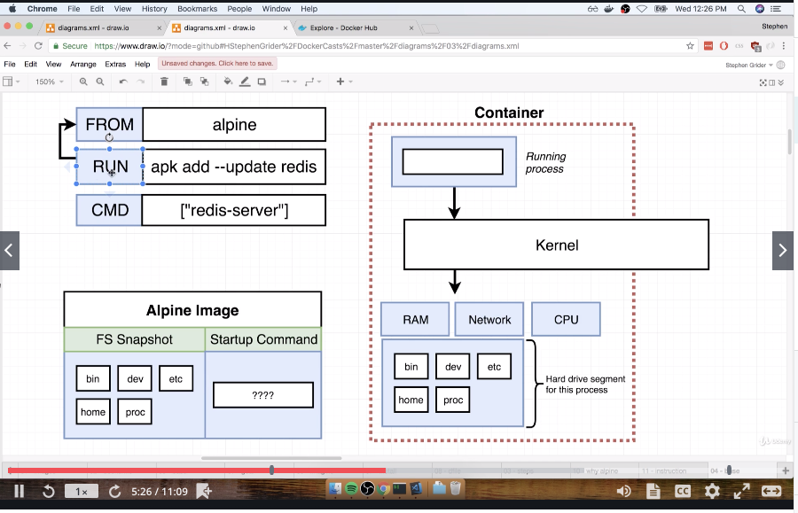

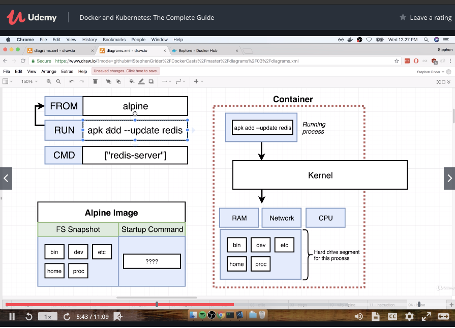

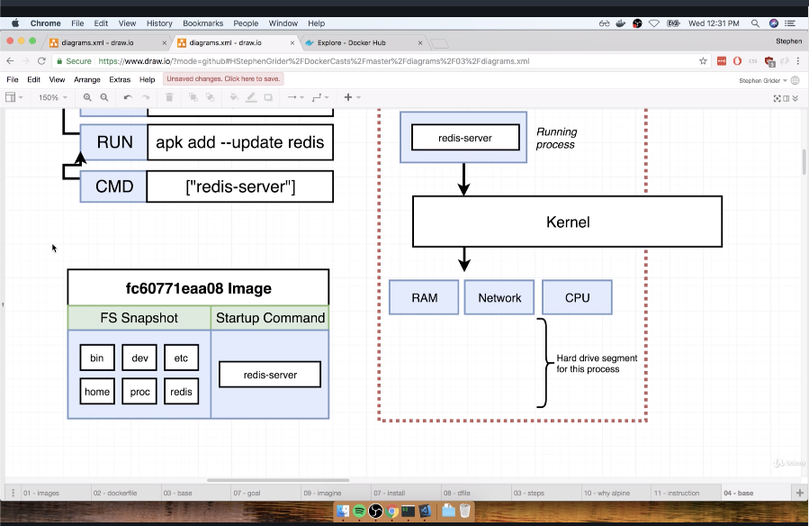

## Video 5: A brief Recap

- Starts with the `FROM alpine` instruction -> gets the base image
- Then the docker server runs the `RUN` instruction and gets the alpine image that was just downloaded
  - Creates a temp. container
  - Contains a modified container with the file system with redis
  - Shutdown the temp container and got the image ready for the next command
- Finally `CMD` instruction runs
  - Get the image from the last step
  - Create a new container (which our container we are going to be using)
  - Shut down the temp container and got it ready for the next instruction
- Finally no more instructions and uses the last container that our instruction ran

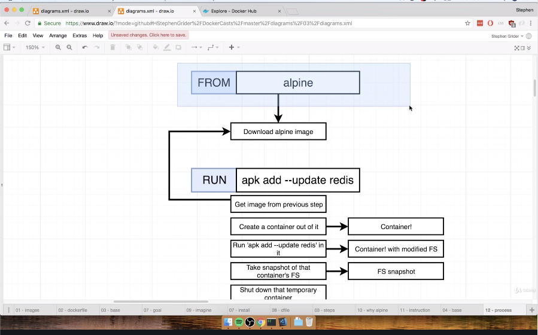

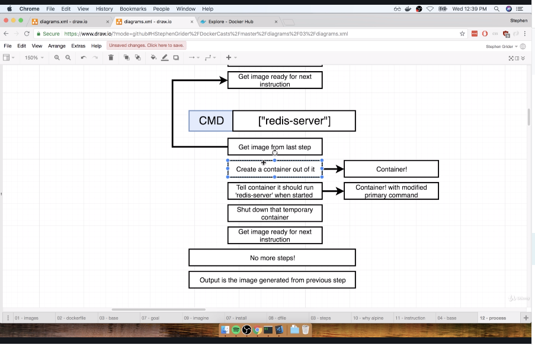

## Video 6: Rebuilds with Cache

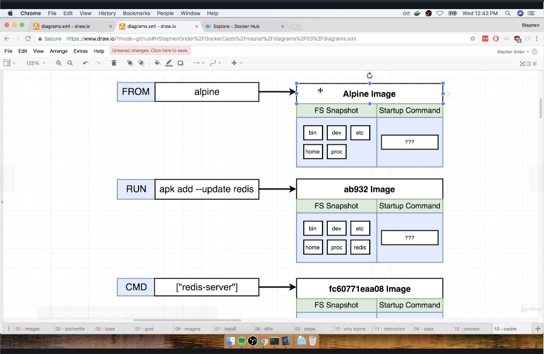

- We get a new image from the each instruction

```md
Step 2/4 : RUN apk add --update redis
---> Using cache -> docker knows that its going to get the same image from the previous step
---> f17b396b25d0
```

- Any time we make a change to our dockerfile, docker knows what dependencies have been added (in our local cache) so it uses cache for preinstalled dependencies, but fetches for new dependency that was added

## Video 7: Tagging an Image

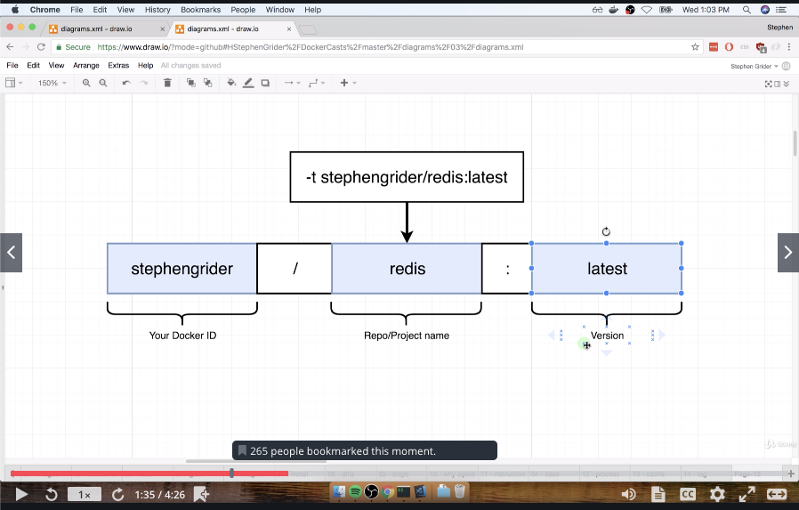

- Ex. `docker build -t hd719/redis:latest .`
- latest -> is technically the tag (the version at the end)

## Video 8: Manual Image Generation with Docker commit

```zsh
docker commit -c 'CMD ["redis-server"]' 09a05698a8f9
sha256:5ea55981a28278dae535e3d29c1ae646da6f874ae9922d01ebb3ba6531e39d90
```

# Series 4: Making Real Projects with Docker

## Video 1: Project Outline

## Video 2: Node Server Setup

## Video 3: Completed Server Code

## Video 4: A Few Planned Errors

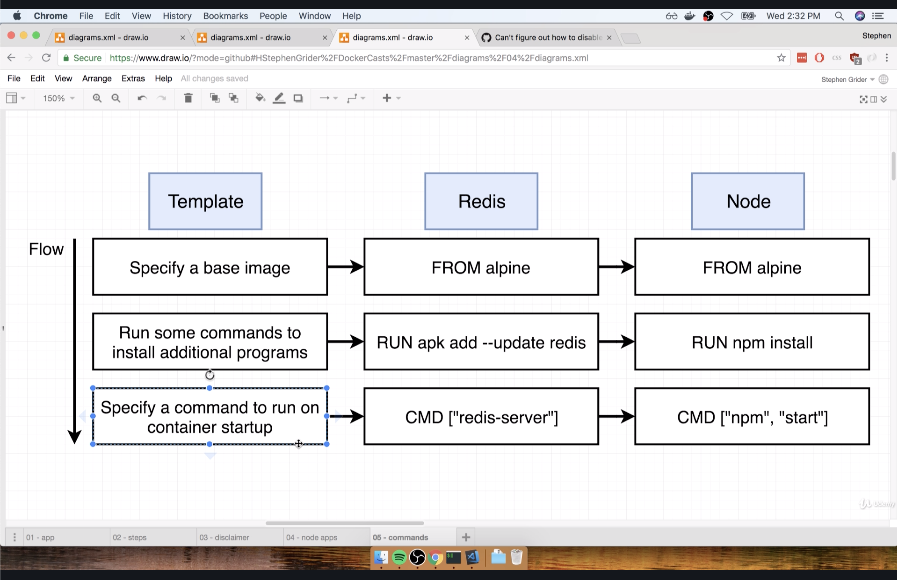

```zsh
❯ docker build .
Sending build context to Docker daemon  4.096kB
Step 1/3 : FROM alpine
 ---> 961769676411
Step 2/3 : RUN npm install
 ---> Running in 43376712a577
/bin/sh: npm: not found
The command '/bin/sh -c npm install' returned a non-zero code: 127
```

- Error b/c in step #2 there is no copy of npm avaible and we are using alpine as our base image (limited set of default programs, not many programs included)
  - So we need to change our base image to something that has the npm program
  - Or build own image from scratch
- `alpine` means you are going to get the min. amount of requirements so for example `node:alpine` you are getting the most stripdown version of nodejs

```zsh
Step 2/3 : RUN npm install
 ---> Running in c8cd6b948233
npm WARN saveError ENOENT: no such file or directory, open '/package.json'
npm notice created a lockfile as package-lock.json. You should commit this file.
npm WARN enoent ENOENT: no such file or directory, open '/package.json'
npm WARN !invalid#2 No description
npm WARN !invalid#2 No repository field.
npm WARN !invalid#2 No README data
npm WARN !invalid#2 No license field.
```

- Missing `package.json` file its not in our FS snapshot
- You need specfically include the path to the `package.json` file (make sure the container has access to the necessary files)

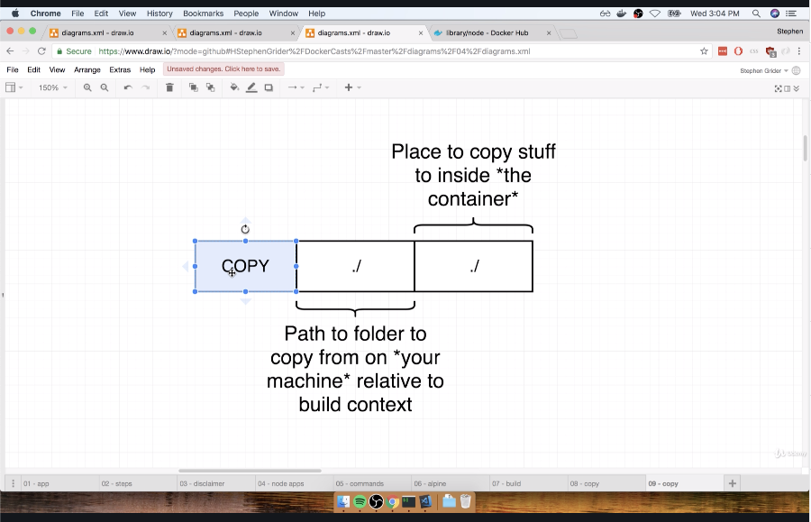

## Video 8: Container Port Mapping

- Right after we start our server we get an error saying `Cannot connect to localhost:8080`

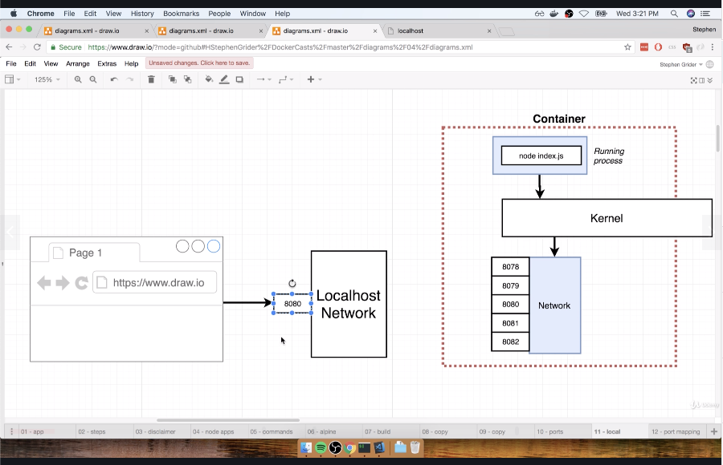

- The container has its own isolated set of ports that different than you computer ports
- Have to explicitly set up port mapping for that particular container

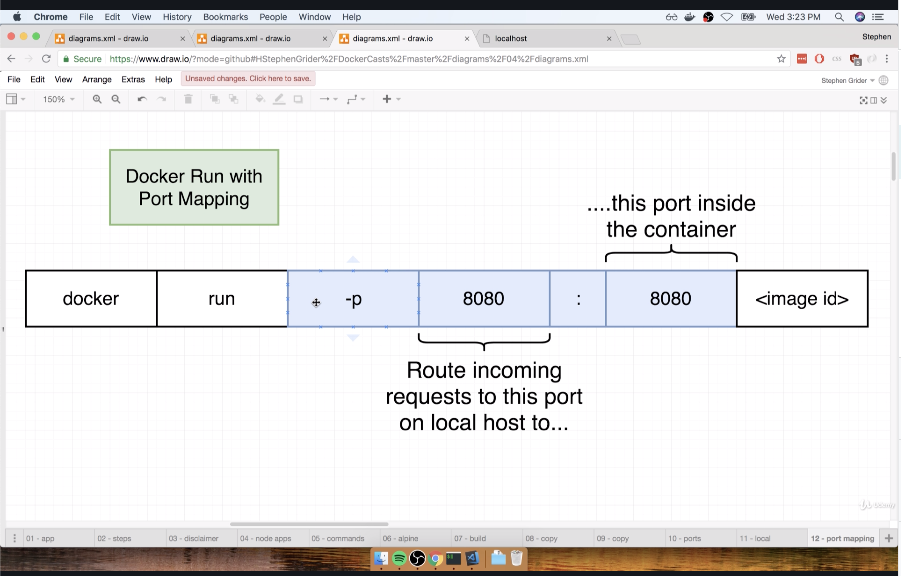

- Docker run with port mapping
- The incoming port does not have to identical to container port
- so if the incoming request port for example is 5000 the outgoing port has to be 8080 (because that is the port we specified in our express app)

## Video 9: Specifying a Working Directory

- `WORKDIR /usr/app`: Any following command will be relative to this path in the container
- best to put app in the `usr` or `home` directory

## Video 10: Unecessary Rebuilds

- When we modify our `index.js` that change is NOT automatically reflected inside our container
- In order to get the new change we would have to rebuild the container (run the docker build command again)
- When we rebuild our container we ran `npm install` again (and this is not ideal)

## Video 11: Minimizing Cachebusting and rebuilds

# Series 5: Docker Compose with Multiple Local Containers

## Video 1: App Overview

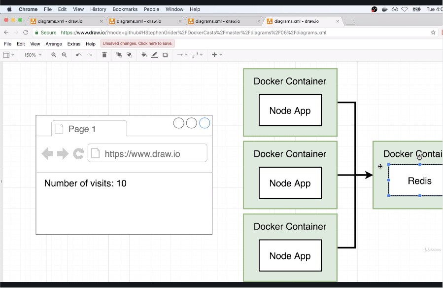

## Video 5: Introducing Docker Compose

- The app will not work b/c the redis container and the nodeapp are running on two different containers
- Need to setup some networking features so the two apps can "talk" to each other
  1. Use Docker CLI networking features: Pain the ass to set this up
  2. Use Docker compose: CLI tool, use to start up mulitple containers

## Video 6: Docker Compose Files

- Going to create a `docker-compose.yml` file that and will be parsed by the `docker-cli` to set up different containers

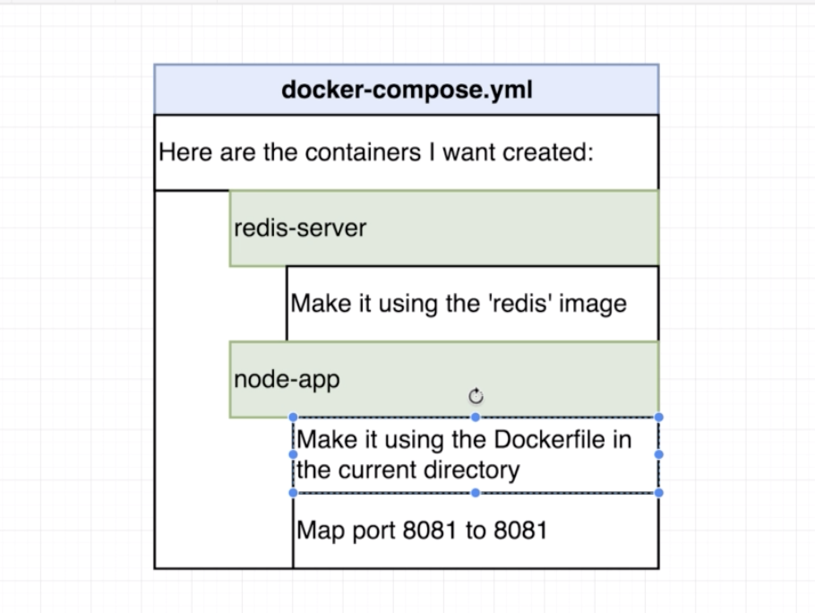

## Video 10 : Container Maintainance with Compose

## Video 11: Automatic Container Restarts

- Going to implement something called restart policies inside our docker-compose file
- By default "no" -> do not attempt to restart container
- Have to add `restart: always/no` to each service
- Reusing the previous container (which is why we are seeing mulitple listings of port 8081)
- If you want to use `no` restart policy you have to do `restart: "no"` has to be added in quotes

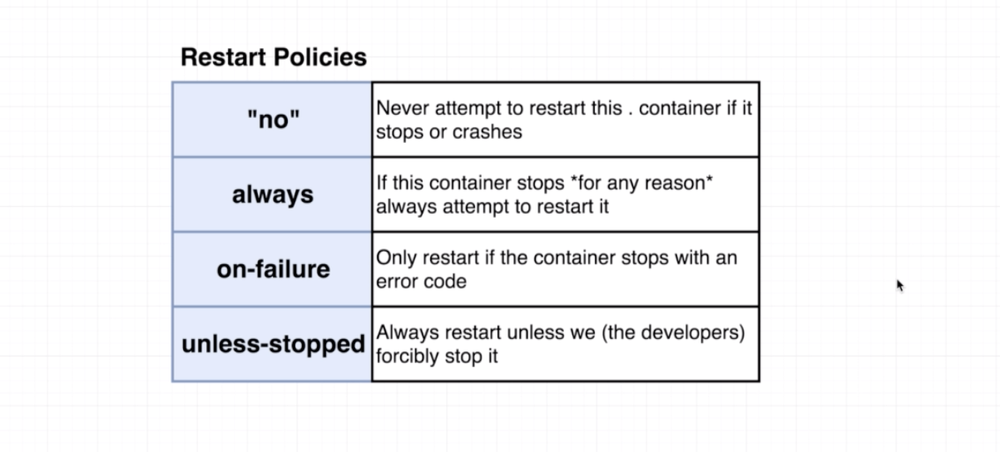

# Series 6: Creating Production-Grade Workflow

## Video 1: Development Workflow

- How to use docker in a production grade application (from creating app to deploying to AWS or Digital Ocean)

## Video 2: Flow Specifics

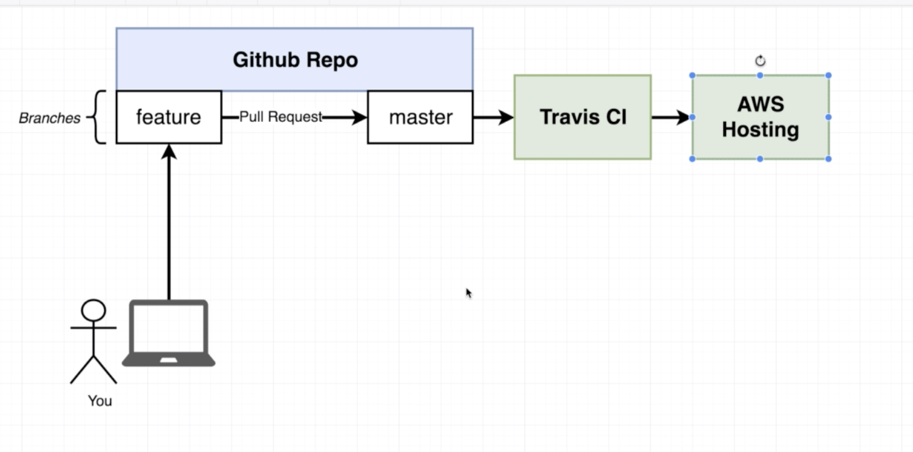

## Video 3: Docker's Purpose

- Docker is a tool making the execution of some these tasks easier

## Video 8: Creating the dev dockerfile

- 2 different docker files

  1. Dev
  2. Prod

- Dockerfile.dev -> only runs in dev env
- Dockerfile -> only runs in prod env

## Video 8: Duplicating Dependencies

```zsh
~/Desktop/Tutorials/Docker and Kubernetes The Complete Guide/Notes/client master*
❯ docker build . -f Dockerfile.dev
Sending build context to Docker daemon    231MBB
```

- Issue: When we installed our create-react-app tool it automatiicaly ran `npm install` which created the `node_modules` directory inside our project directory
- In the past we did relied on docker running `npm install` and installing our dependencies
- So we essentially we have 2 copies of dependencies
  1. First copy is inside our project directory
  2. Second copy is going to be created when we run our docker image
- So we need to delete one (the recommended one is deleting the node_modules inside our project directory)

## Video 11: Docker Volumes && Fix for ENOENT: no such file or directoy open pacakge.json && Bookmarking Volumes

- Volumes: Set up a placeholder inside our docker container, which will act as a reference to our local folder and it will give us access to these local folders inside our local machine (kind of like port mapping)

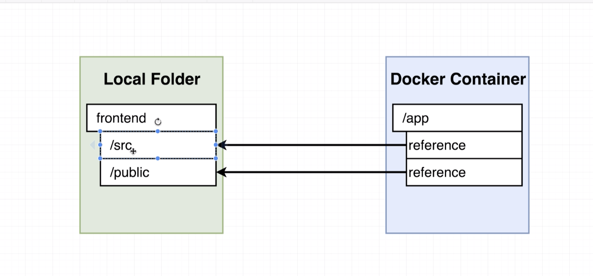

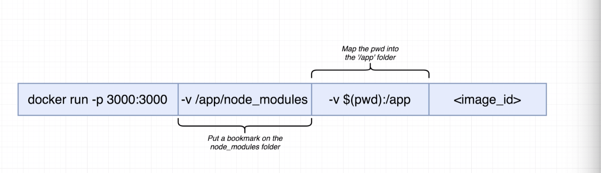

- `docker run -p 3000:3000 -v /app/node_modules -v $(pwd):/app <image_id>`
- `-v`: stands for volume
- `-v$(pwd):/app`: take everything inside the current directory and mapp it to the app folder in the container
- `-v/app/node_modules`: We need a node_modules reference b/c we deleted our node_modules directory so the reference is actually pointing to nothing
- `:` -> **NOTE** this colon represents a placeholder (so for example app/node_modules means we are referencing something inside our container versus \$(pwd):/app where we want to map a folder to our container)

## Video 13: Shorthand with Docker Compose

- Creating a `docker-compose.yml` file to make our docker run command easier
- Example: `docker-compose.yml` file

## Video 14: Overriding Dockerfile Selection

- Example: `docker-compose.yml` file

## Video 15: Do we need copy

- Recap: We ran set up the `docker-compose` file which is going to start up 1 container with two different volume mounts

  1. Bookmark (reference) to node_modules locally inside the container
  2. To map up our source code inside the container

- We can remove the `COPY` instruction from the dockerfile (if we wanted to) b/c we are copying our source code through our `docker-compose.yml` files `- .:/app`

## Video 17: Live Updating Tests

1. We can attatch into the current container that is created and once we attache we can execute a test suite that will run our tests (not the BEST way)

2. We can create a new service that can watch for changes in our test file (not the perfect solution)

## Video 18: Docker Compose for running tests

## Video 20: Shortcomings on testing

- We created a new container to run our test the problem is we arent able to interact with our test suite

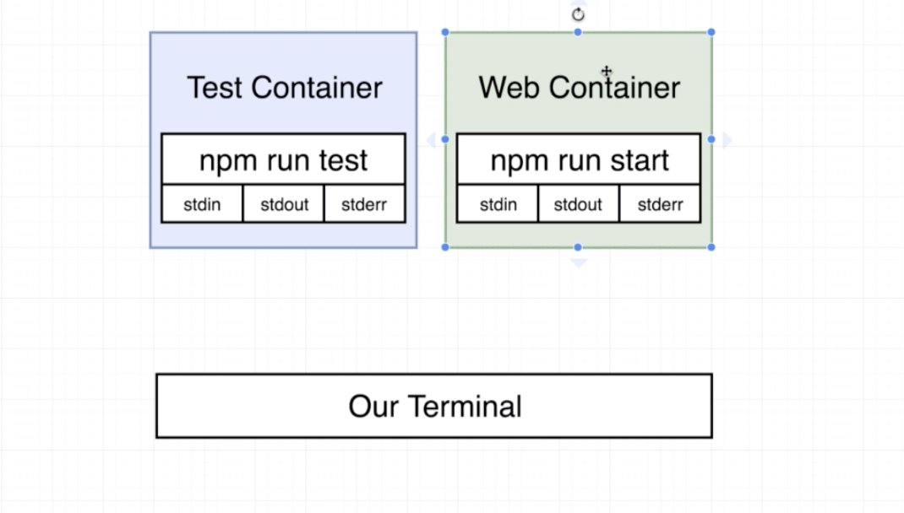

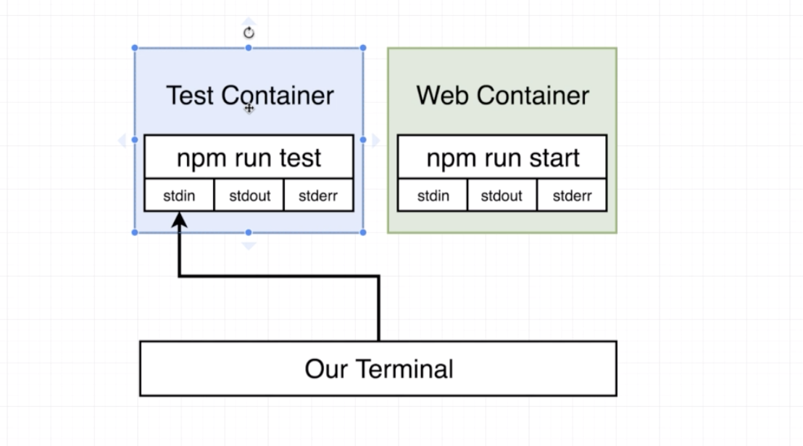

- We want to be able to connect our input to the `stdin` processes (ideal, not by default)
- Adding the word `attatch` to `docker attatch <image id>` we are attatching to `stdin, stdout, and stderror` for that container

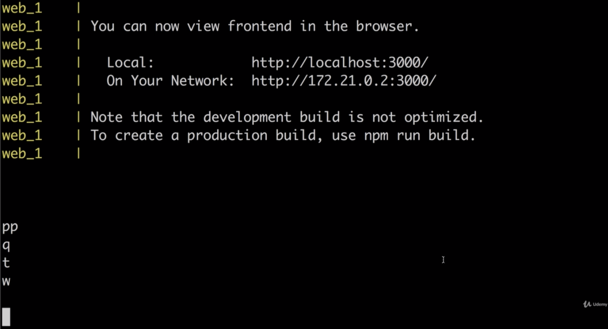

- We are able to type in our terminal, but cannot interactive with the test suite b/c it comes down to all the different processess that have been created inside the container
- So for example when we run `npm run test` inside our container we are actually not running `npm run test` we are running `npm` and then docker looks at the addtional arguements that were passed and runs a second process to run the tests

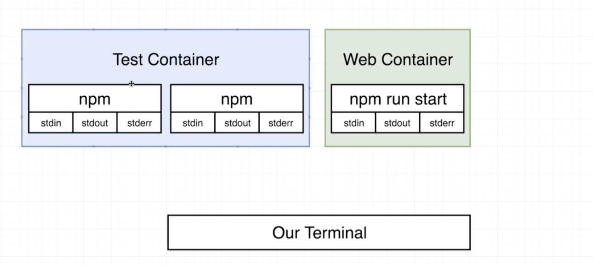

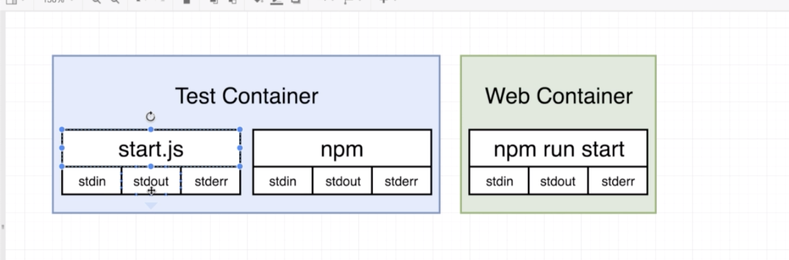

- So its actually the second process that is running our test suite and determining if we need to re-run the test suite

**NOTE** when we use the command `attach` we are attaching to the first process (in this case npm) and specifically attatching to `stdin`

- So to fix this we would want to attatch to the second process `stdin` (not an option for docker attach)

## Video 21: Need for Nginx

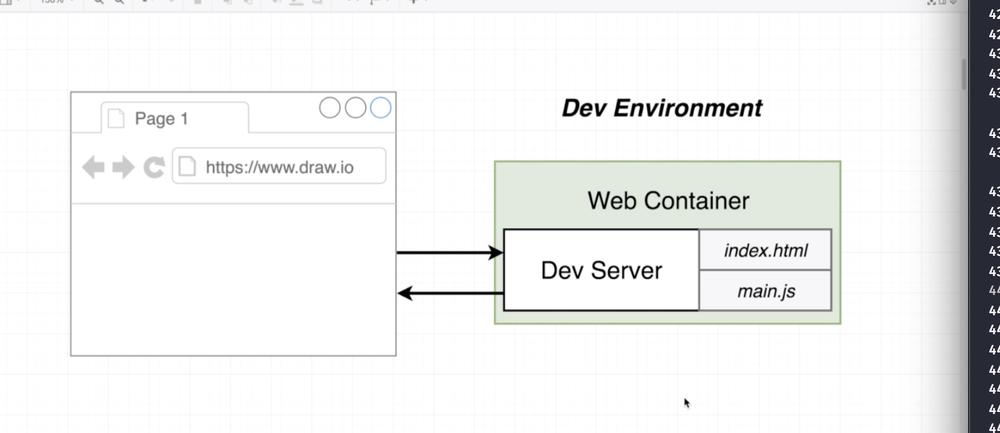

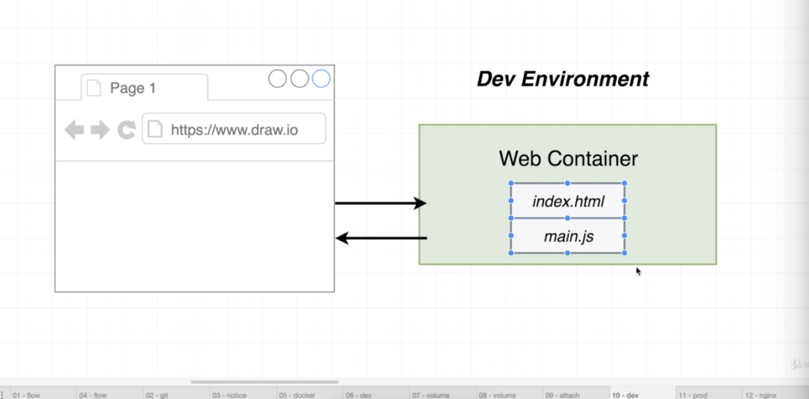

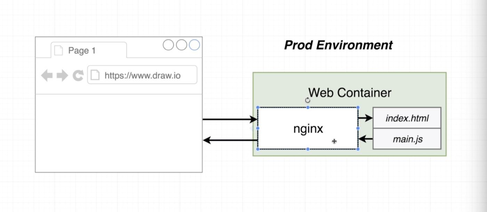

- Nginx: Web server, takes incoming traffic and serves static files

## Video 22: Multistep docker builds

- Creating a production env. docker file


- Two big issues

  1. Dependencies are only required when we are trying to build the application (not worth carrying around b/c its too big 150 MB)
  2. Need to start and set up nginx (need to set up two different base images)

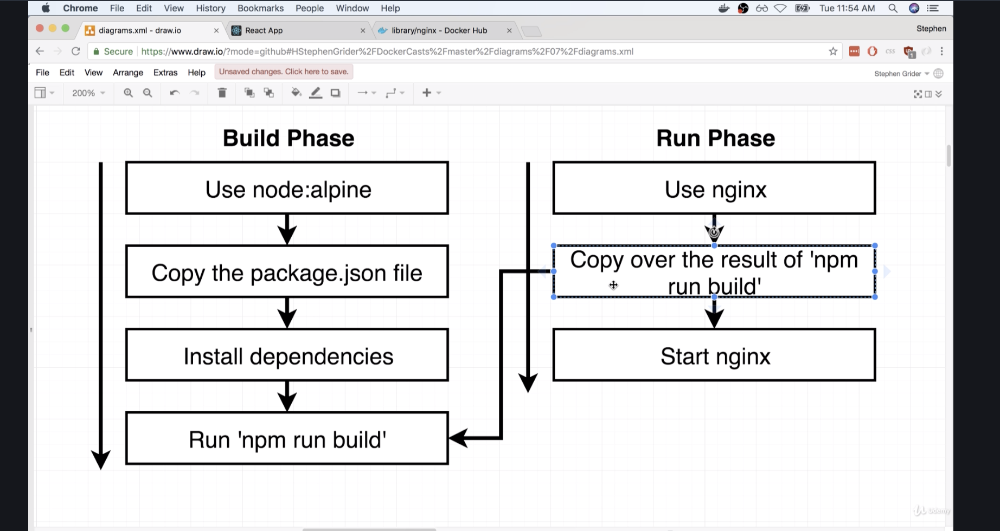

- Build phase: returns our apps build folder
- Run phase: copy over our apps build folder and start nginx (everything else that happens in the build phase gets dropped)

## Video 23: Implementing Multi-step builds

- Look at `Dockerfile`

# Series 7: Continous Integration and Deployment w/ AWS

## Video 1: Services Overview

## Video 2: Github Setup

## Video 3: Travis CI setup

## Video 4: Travis YML File Config

## Video 5: Fix for Failing Travis Builds

## Video 6: A Touch more Travis Setup

## 7: Automatic Build Creation

## 8: AWS Elastic Beanstalk

## 9: Elastic Beanstalk More

## 10: Travis Config for Deployment

## 11: Travis Script for access_key_id

## 12: Automated Deployments

## 13: Exposing Port through Dockerfile

## 14: AWS build still failing

## 15: Workflow with github

## 16: Redeploy on PR merge

## 17: Deployment wrapup

## 18: Env Clean up
