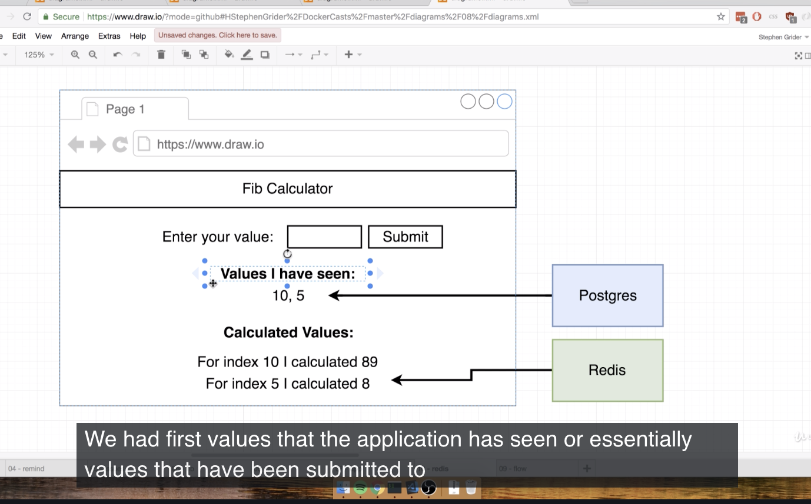
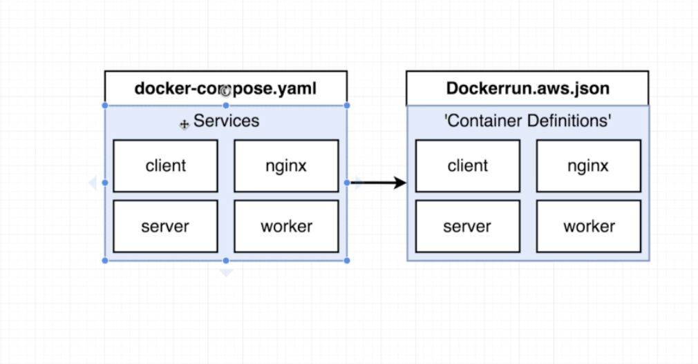
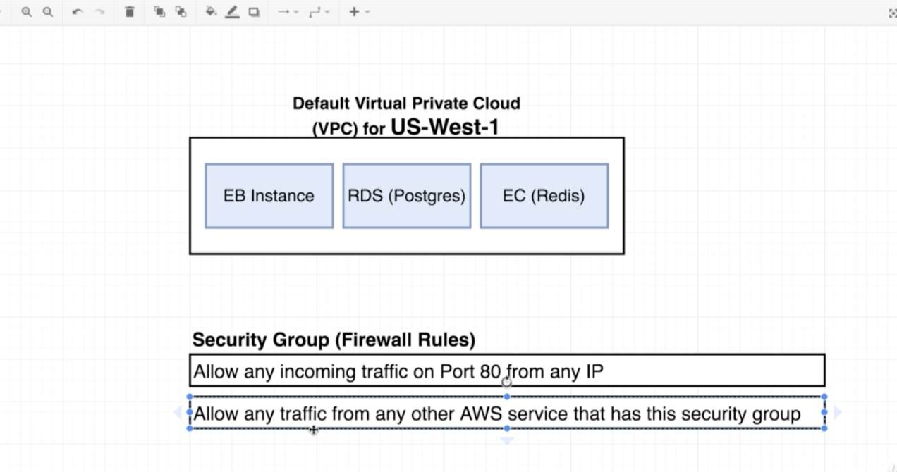
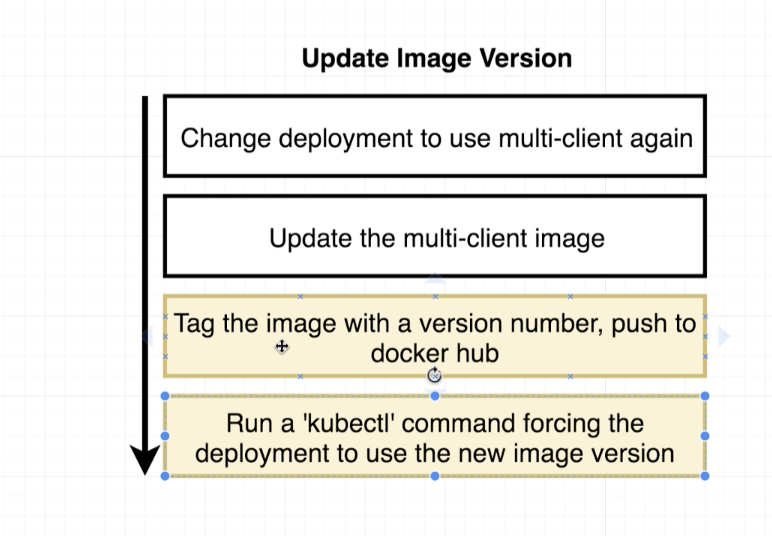
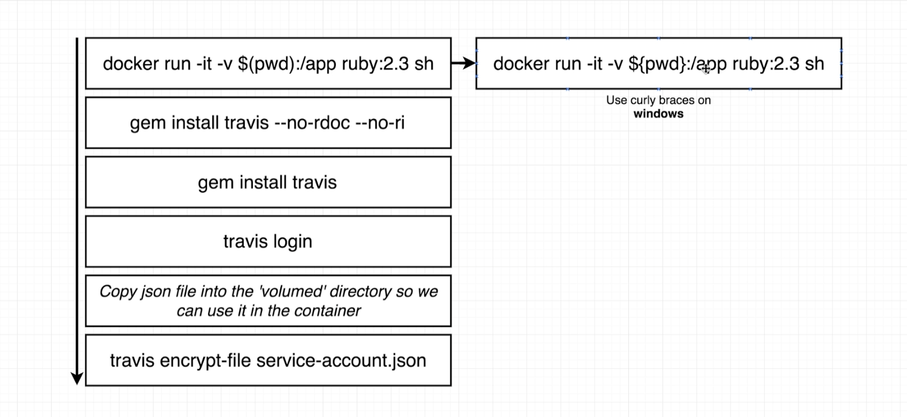

# Series 1: Dive Into Docker

## Video 1: Why we use docker

- Installing software on your computer (locally)
- Docker solves that problem
- Really easy and straightforward to run software any given computer (or any cloud based computing platform) without having to do any setup and worrying about dependencies

## Video 2: What is docker

- Docker itself is a platform or ecosystem around creating and running containers (when someone talks about docker they are usually talking about the this ecosystem)


- Tools that come together so create a platform

### What is a container

- Image: Single file with all of dependencies and config required to run a very specific program (file gets stored on your hard drive)
- Container: Is an instance of an image (think of it as a running program), also a program of its own isolated set of resources (own space of memory, hard drive space, own space for networking)

## Video 3: Docker for windows/mac

- When installing docker for mac/windows we install two pieces
  1. Docker Client: Used to run commands in the terminal
  2. Docker Server: (Docker Daemon) tool that is responsible for creating images, running containers etc.

## Video 4: Installation MacOS


## Video 10: Using Docker Client

Ex. What happens when you run `docker run`


- Starts up the docker-cli
- Communicating the commands to the docker server (charge of heavy lifting)
- Docker server saw we were starting a new container called `Hello World`
- Docker server checks the image cache (locally) to see if the image exists
- Docker hub free docker images that you can download on your computer

## Video 11: But Really what is a container

- In order to understand how a container is running on your computer you first need to understand how the underlying OS works


- Kernel: A running software process that governs access between programs that are running on your computer and all the physical hardware that is connected to your computer
- System Call: A way for the running programs to issue requests to the kernel and interact with a piece of hardware (function invocations, kernel says if you want to use this piece of hardware here is an endpoint or call this endpoint right here)

Example Situation (make believe)


- Name spacing: segment out portion of the resources (some use pv2 and some use pv3)

  - Isolating resources per process (or group of processes)

- Control Groups: Limit amount of resources used per process


- Set up of processes that has a grouping of processes assigned to it

### What is the relation between image and container


- Image: fs snapshot

## Video 12: How Docker is running on your computer


- Basically when you start up docker it runs a linux virtual machine and you can see the virtual machine by running the command `docker version` and looking at the OS/Linux line

# Series 2: Manipulating Containers with the Docker Client

## Video 1: Docker Run in Detail

- When we run the command `docker run hello-world` it tries to find the image locally if it cannot it will pull the image from docker-hub and docker will create a container with the isolated resources to run the program (see image below for container example)


- FS: filesystem

## Video 2: Overriding Default Commands

- `docker run busybox echo hi there`: echo hi there -> is known as the default command override
- `docker run busybox ls`: returns folders that are in the container
- We use busybox b/c `ls` and `echo` programs exist in the busybox container folder, the hello-word program does not contain any of those folders

## Video 3: Listing Running Containers

- `docker ps`: lists all running containers, also running this command will display the id of the container
- As of right now we have been running containers that run and shut down immediately

## Video 4: Container life cycle

- Creating a container and starting a container are two different processes
- `docker run` = `docker create` + `docker start`
- `docker create` returns the id of the container
- `docker start -a docker create hello-word` (-a watches the output and prints to the terminal)
- `docker run`-> shows output, `docker start` does not

## Video 5: Restarting Stopped Containers

- When a container is exited you can still start it back up, by taking the id and running `docker start <id>`

## Video 6: Removing Stopped Containers

- `docker system prune`: deletes stopped containers, deletes build cache (going to have to re-download images from docker hub) shows disk space that was reclaimed

## Video 7: Retrieving log outputs

- `docker logs <container id>`: shows log output, good way to inspect the container and see whats going on

## Video 8: Stopping Containers

- `docker stop <id>`: stops running container (run SIGTERM, gives it time to shutdown and cleans up the process)
- `docker kill <id>`: kill the running container (runs SIGKILL, means you have to shut down right now and no additional work)
- If `docker stop` does not work within 10 seconds it will automatically run `docker kill`

## Video 9: Multi Command Containers

## Video 10: Executing Commands in Running Containers

- `docker exec -it <id> <command>`: lets us exec into the container
- Ex. `docker exec -it <id> redis-cli`

## Video 11: The Purpose of IT Flag


-i: attaching to the STDIN (standard in)
-t: all the text comes out in a nicely formatted way

## Video 12: Getting Command Prompt in Container (Open up terminal in docker container)

- `docker exec -it <id> sh`: exec into shell (type commands in Unix env.) -> good for debugging


## Video 13: Starting with Shell

## Video 14: Container Isolation

# Series 3: Building Custom Images Through Docker Server

## Video 1: Creating Docker Images

- To create a docker image (Dockerfile -> Docker Client -> Docker Server -> Usable image)
- Dockerfile: Flow
  1. Specify Base Image
  2. Run some commands to install additional dependencies
  3. Specify a command to run on container start up

## Video 2: Building Dockerfile

- Goal: Create an image that runs redis-server

## Video 3: Dockerfile Teardown

- Look at Dockerfile in redis-image dir.


## Video 4: Whats a Base Image/Build Process in Detail?


## Video 5: A brief Recap

- Starts with the `FROM alpine` instruction -> gets the base image
- Then the docker server runs the `RUN` instruction and gets the alpine image that was just downloaded
  - Creates a temp. container
  - Contains a modified container with the file system with redis
  - Shutdown the temp container and got the image ready for the next command
- Finally `CMD` instruction runs
  - Get the image from the last step
  - Create a new container (which our container we are going to be using)
  - Shut down the temp container and got it ready for the next instruction
- Finally no more instructions and uses the last container that our instruction ran


## Video 6: Rebuilds with Cache


- We get a new image from the each instruction

```md
Step 2/4 : RUN apk add --update redis
---> Using cache -> docker knows that its going to get the same image from the previous step
---> f17b396b25d0
```

- Any time we make a change to our dockerfile, docker knows what dependencies have been added (in our local cache) so it uses cache for preinstalled dependencies, but fetches for new dependency that was added

## Video 7: Tagging an Image


- Ex. `docker build -t hd719/redis:latest .`
- latest -> is technically the tag (the version at the end)

## Video 8: Manual Image Generation with Docker commit

```zsh
docker commit -c 'CMD ["redis-server"]' 09a05698a8f9
sha256:5ea55981a28278dae535e3d29c1ae646da6f874ae9922d01ebb3ba6531e39d90
```

# Series 4: Making Real Projects with Docker

## Video 1: Project Outline

## Video 2: Node Server Setup

## Video 3: Completed Server Code

## Video 4: A Few Planned Errors


```zsh
❯ docker build .
Sending build context to Docker daemon  4.096kB
Step 1/3 : FROM alpine
 ---> 961769676411
Step 2/3 : RUN npm install
 ---> Running in 43376712a577
/bin/sh: npm: not found
The command '/bin/sh -c npm install' returned a non-zero code: 127
```

- Error b/c in step #2 there is no copy of npm available and we are using alpine as our base image (limited set of default programs, not many programs included)
  - So we need to change our base image to something that has the npm program
  - Or build own image from scratch
- `alpine` means you are going to get the min. amount of requirements so for example `node:alpine` you are getting the most strip down version of nodejs

```zsh
Step 2/3 : RUN npm install
 ---> Running in c8cd6b948233
npm WARN saveError ENOENT: no such file or directory, open '/package.json'
npm notice created a lockfile as package-lock.json. You should commit this file.
npm WARN enoent ENOENT: no such file or directory, open '/package.json'
npm WARN !invalid#2 No description
npm WARN !invalid#2 No repository field.
npm WARN !invalid#2 No README data
npm WARN !invalid#2 No license field.
```

- Missing `package.json` file its not in our FS snapshot
- You need specifically include the path to the `package.json` file (make sure the container has access to the necessary files)


## Video 8: Container Port Mapping

- Right after we start our server we get an error saying `Cannot connect to localhost:8080`


- The container has its own isolated set of ports that different than you computer ports
- Have to explicitly set up port mapping for that particular container


- Docker run with port mapping
- The incoming port does not have to identical to container port
- so if the incoming request port for example is 5000 the outgoing port has to be 8080 (because that is the port we specified in our express app)

## Video 9: Specifying a Working Directory

- `WORKDIR /usr/app`: Any following command will be relative to this path in the container
- best to put app in the `usr` or `home` directory

## Video 10: Unnecessary Rebuilds

- When we modify our `index.js` that change is NOT automatically reflected inside our container
- In order to get the new change we would have to rebuild the container (run the docker build command again)
- When we rebuild our container we ran `npm install` again (and this is not ideal)

## Video 11: Minimizing Cachebusting and rebuilds

# Series 5: Docker Compose with Multiple Local Containers

## Video 1: App Overview


## Video 5: Introducing Docker Compose

- The app will not work b/c the redis container and the nodeapp are running on two different containers
- Need to setup some networking features so the two apps can "talk" to each other
  1. Use Docker CLI networking features: Pain the ass to set this up
  2. Use Docker compose: CLI tool, use to start up multiple containers

## Video 6: Docker Compose Files

- Going to create a `docker-compose.yml` file that and will be parsed by the `docker-cli` to set up different containers


## Video 10 : Container Maintenance with Compose

## Video 11: Automatic Container Restarts

- Going to implement something called restart policies inside our docker-compose file
- By default "no" -> do not attempt to restart container
- Have to add `restart: always/no` to each service
- Reusing the previous container (which is why we are seeing multiple listings of port 8081)
- If you want to use `no` restart policy you have to do `restart: "no"` has to be added in quotes


# Series 6: Creating Production-Grade Workflow

## Video 1: Development Workflow

- How to use docker in a production grade application (from creating app to deploying to AWS or Digital Ocean)

## Video 2: Flow Specifics


## Video 3: Docker's Purpose

- Docker is a tool making the execution of some these tasks easier

## Video 8: Creating the dev dockerfile

- 2 different docker files

  1. Dev
  2. Prod

- Dockerfile.dev -> only runs in dev env
- Dockerfile -> only runs in prod env

## Video 8: Duplicating Dependencies

```zsh
~/Desktop/Tutorials/Docker and Kubernetes The Complete Guide/Notes/client master*
❯ docker build . -f Dockerfile.dev
Sending build context to Docker daemon    231MBB
```

- Issue: When we installed our create-react-app tool it automatically ran `npm install` which created the `node_modules` directory inside our project directory
- In the past we did relied on docker running `npm install` and installing our dependencies
- So we essentially we have 2 copies of dependencies
  1. First copy is inside our project directory
  2. Second copy is going to be created when we run our docker image
- So we need to delete one (the recommended one is deleting the node_modules inside our project directory)

## Video 11: Docker Volumes && Fix for ENOENT: no such file or directory open package.json && Bookmarking Volumes

- Volumes: Set up a placeholder inside our docker container, which will act as a reference to our local folder and it will give us access to these local folders inside our local machine (kind of like port mapping)


- `docker run -p 3000:3000 -v /app/node_modules -v $(pwd):/app <image_id>`
- `-v`: stands for volume
- `-v$(pwd):/app`: take everything inside the current directory and map it to the app folder in the container
- `-v/app/node_modules`: We need a node_modules reference b/c we deleted our node_modules directory so the reference is actually pointing to nothing
- `:` -> **NOTE** this colon represents a placeholder (so for example app/node_modules means we are referencing something inside our container versus \$(pwd):/app where we want to map a folder to our container)

## Video 13: Shorthand with Docker Compose

- Creating a `docker-compose.yml` file to make our docker run command easier
- Example: `docker-compose.yml` file

## Video 14: Overriding Dockerfile Selection

- Example: `docker-compose.yml` file

## Video 15: Do we need copy

- Recap: We ran set up the `docker-compose` file which is going to start up 1 container with two different volume mounts

  1. Bookmark (reference) to node_modules locally inside the container
  2. To map up our source code inside the container

- We can remove the `COPY` instruction from the dockerfile (if we wanted to) b/c we are copying our source code through our `docker-compose.yml` files `- .:/app`

## Video 17: Live Updating Tests

1. We can attach into the current container that is created and once we attache we can execute a test suite that will run our tests (not the BEST way)

2. We can create a new service that can watch for changes in our test file (not the perfect solution)

## Video 18: Docker Compose for running tests

## Video 20: Shortcomings on testing

- We created a new container to run our test the problem is we aren't able to interact with our test suite


- We want to be able to connect our input to the `stdin` processes (ideal, not by default)
- Adding the word `attach` to `docker attach <image id>` we are attaching to `stdin, stdout, and stderror` for that container


- We are able to type in our terminal, but cannot interactive with the test suite b/c it comes down to all the different processes that have been created inside the container
- So for example when we run `npm run test` inside our container we are actually not running `npm run test` we are running `npm` and then docker looks at the additional arguments that were passed and runs a second process to run the tests


- So its actually the second process that is running our test suite and determining if we need to re-run the test suite

**NOTE** when we use the command `attach` we are attaching to the first process (in this case npm) and specifically attaching to `stdin`

- So to fix this we would want to attach to the second process `stdin` (not an option for docker attach)

## Video 21: Need for Nginx


- Nginx: Web server, takes incoming traffic and serves static files

## Video 22: Multi Step docker builds

- Creating a production env. docker file


- Two big issues

  1. Dependencies are only required when we are trying to build the application (not worth carrying around b/c its too big 150 MB)
  2. Need to start and set up nginx (need to set up two different base images)


- Build phase: returns our apps build folder
- Run phase: copy over our apps build folder and start nginx (everything else that happens in the build phase gets dropped)

## Video 23: Implementing Multi-step builds

- Look at `Dockerfile`

# Series 7: Continuos Integration and Deployment w/ AWS

## Video 1: Services Overview

## Video 2: Github Setup

## Video 3: Travis CI setup

- Travis CI integration with Github


- Used for testing codebase and deployment to AWS
- First thing to do is tell Travis Ci to watch for a specific github repo (docker-react)

## Video 4: Travis YML File Config


- So essentially Travis will run every time we push our commits to github
- In development env. we need to run the `Dockerfile-dev` file b/c the purpose of travis is to run our test suite
- Compared to our production docker file which DOES NOT run our test suite

- Example: Look at `.travis.yml` file

## Video 5: Fix for Failing Travis Builds

- Example: Look at `.travis.yml` file

## Video 6: A Touch more Travis Setup

- Example: Look at `.travis.yml` file

## 7: Automatic Build Creation

- [Docker-React-Travis](https://travis-ci.org/hd719/docker-react)

## 8: AWS Elastic Beanstalk

## 9: Elastic Beanstalk More


- Helps us scale based on the incoming requests that are coming into our application

## 10: Travis Config for Deployment

- Example: Look at `.travis.yml` file

## 11: Travis Script for access_key_id

- Example: Look at `.travis.yml` file

## 12: Automated Deployments

- Example: Look at `.travis.yml` file

## 13: Exposing Port through Dockerfile


- B/c we didn't expose a port in our production dockerfile AWS elasticbeanstalk failed to update our app url

# Series 8: Building Multi-Container Application

## 4: Application Architecture





## 5: Worker Process Setup

- So first thing we are going to set up is the worker process which watches redis for new indices and calculates new value

## 6: Express API Setup

- The express API will communicate with PG and Redis (request will come from the React App)

- Connecting to redis

# Series 9: Dockerizing Multiple Services (App: complex)

## 7: Env. Variables with Docker Compose


## 8: The Worker and Client Services

- Going to add worker and client projects (service)
- Created client and worker service
- Did not set up any port mapping to expose the server to the outside world or the react app

## 9: Nginx Path Routing

- Last project we used nginx in production


- So in the above diagram the browser will be making calls to the React Server to get files like the `index.html` and `main.js`
- The browser will also make api calls but those calls will be handled by our express server


- So nginx will routing each request from the browser to the correct server


- So we will be adding in a container (nginx) to our services in the `docker-compose.yml` file
- All routes will be handled will be by nginx and any request appended with `/api` will be handled by our express server
- Anything with `/` will be handled by our react server
- Note: Nginx will remove the `/api` once the req reaches the express server
- The reason we did not assign a port (express port: 3000 and react server port: 5000) b/c in a prod env the port numbers will be different based on server or env config also it would not be convenient if we have to append a port number on each route
- In our express app the api route does not `/api` b/c once nginx knows that it is an api route it will remove the `/api` and send the request off to the express server

## 10: Routing with Nginx


- Going to create a file called `default.conf` -> implement a set of routing rules for Nginx
- React server and express server are behind nginx and known as `upstream servers`
- So Nginx can redirect traffic to these upstream servers
- `client:3000` and `server:5000` are more like addresses (host names), the reason we are using `client` and `server` because those are the services specified in our `docker-compose.yml` file
- The services are known as domain
- We tell Nginx service (our nginx container) to listen on port 80 (inside the container)
- Then finally we set up the two rules (the last two rows in the example 8-9)

## 11: Building a Custom Nginx Image

`default.conf` file

## 12: Starting up Docker Compose

- Testing everything out
- Command: `docker-compose up --build` -> force a rebuild of everything

## 15: Opening Websocket Connections

- Problem: We didn't allow our nginx server to handle websocket connections

# Series 10: A Continuos Integration Workflow for Multiple Containers

## 1: Production Multi-Container Deployments

- In the last application we made EBS build our image and deploy it, not a good idea b/c we were building everything and depending on a web server to build images and deploy


- Make travis in charge of building our production image files
- Once travis pushes the build production images to Docker Hub
- EB will pull the latest images (the image has been built) and deploys

- Note: Everything is done by travis instead of EB

## 2: Production Dockerfiles

1. The first step is ensuring we have production version of docker files ready to go (currently all our dockerfiles have the `.dev` extension)

## 3: Multiple Nginx Instances


- There will be two copies for Nginx
  1. Responsible for ROUTING
  2. Nginx with Production React files (serve assets)

## 4: Altering Nginxs Listen Port

- Added a `default.conf` file in our client side project so in production nginx will be listening on port:3000 (like our app react)

## 5: Nginx for React Router

```conf
server {
  listen 3000;

  location / {
    root /usr/share/nginx/html;
    index index.html index.htm;
    try_files $uri $uri/ /index.html;  <<------ For React Router
  }
}
```

## 6: Cleaning up Tests

- Making sure our tests run without crashing

## 7: Github and Travis CI SetUp


- Once the repository is created and the latest code is pushed up, time to setup Travis

  1. Navigate to travis-ci.org
  2. Click on my profile
  3. Click on sync account -> gets all the recently updated repos
  4. Click on slider to enable as a build project
  5. Navigate back to the home page and you should see the `complex` repository

- Build will fail b/c there is no travis-ci file

## 8: Fix for Failing Travis Builds


- Look at `.travis.yml` file

## 9: Pushing Images to Docker Hub

- In order for us to push our images to Docker-Hub we have to first login
- In travis-ci.org we will add our username and password as environmental variables so we can access them in our `.travis.yml` file

## 10: Successful Image Building

# Series 11: Multi-Container Deployments to AWS

## 1: Multi-Container Definition Files

- In our project (Complex) we have multiple dockerfiles and when they are received by Amazon EB, it does not know which dockerfile to run (unlike our other simple project where we had only 1 dockerfile)


- `Dockerrun.aws.json`: that is going to tell EB where to pull our images from, what resources it should allocate to each image, how to set up port mappings, and other stuff
- Works directly with AWS



- Similar to our `docker-compose.yml` file
- The AWS json file we are going to tell EB to pull the latest image for each service definition

## 2: Finding Docs on Container Definitions


- EB does not really know how to work with container(s)
- Amazon Elastic Container Service (ECS): EB delegates the responsibility to run the container to AECS, you create task definitions and it tells ECS how to run 1 single container

## 3: Adding Container Def. to Docker Run

```json
{
  "name": "client",
  "image": "hd719/complex-client",
  "hostname": "client",
  "essential": false
}
```

- hostname: is the name of the container in our group of containers, this will allow you to reference all other containers within the `Dockerrun.aws.json` file

## 4: More Container Definitions

## 5: Forming Container Links

- hostPort: open up a port on the host (or on the machine that is hosting all of our containers)


- links: unidirectional that points to different containers (basically saying that route some traffic to client or if its has to do with api then route to the express server)

## 6: Creating the EB Environment

1. Navigate to `aws.amazon.com`
2. Log in
3. Set up a new service in Elastic Beanstalk
4. **Note: Make sure you delete the application or instances in EBS or you will be billed**
5. Click on `Create New Application`
6. Create a new Env
7. Fill the form, but choose `Multi-Container Docker`
8. Click on Create Env.

## 7: Managed Data Service Providers

- Running DB inside containers
  - There are no references inside our `travis` file and `Dockerrun.aws.json`
  - In Dev. env we are running our DBs inside containers
  - But as we move into a production env. we have set up a new architecture


- 2 external services

  1. AWS Relational Database Service (RDS)
  2. AWS Elasti Cache

- You can use these data services with any applications


- Professional Grade redis (made for production environments)
- Settings are defaulted for production env.
- Easy to scale


- Professional Grade redis (made for production environments)
- Settings are defaulted for production env.
- Selling Point: Automated backups and rollbacks

- Services due cost a little extra money (dollars per month)

## 8: Overview of AWS VPC's and Sec. Groups

- We are going to learn how to set up these outside DB services (AWS RDS and AWS EC) into Elastic Beanstalk Instance
- By default the Elastic Beanstalk instance cannot talk to our DB services
- We have to form a distinct link between our EBS instance and our DB services


- `Default Virtual Private Cloud (VPC)`: is its own private network so any service that you create is isolated to your account, you can also add a lot of security rules (In each of these regions you get something that is created for you, VPC)
- 1 default VPC per region
- Access VPC

  1. Go to the AWS console and search for `VPC` which will bring the `VPC` dashboard
  2. Click on `Your VPC` and you can see all the VPCs

- In order to get all these services to connect to each other we have to create something called `Security Group`
- `Sec Group (Firewall Rules)`: rules that allow internet traffic to connect to your VPC
  1. Allow any incoming traffic on Port 80 from any IP
  2. Allow traffic on Port 3010 from IP 172.0.40.2 (custom sec group)




- Sec Group Rules


## 9: RDS Database Creation

- When creating a username and password for postgres on RDS (AWS) it must match up to the services in the docker-compose file

## 10: ElastiCache Redis Creation

## 11: Creating a Custom Sec. Group

- The sec. group that needs to be selected is `sg-complex-XXXXXX` (the sec group that was just created in the previous video)

## 12: Applying Sec. Groups to Resources

- First Sec Group we are linking is for `Elasti Cache` instance for redis

  1. Navigate to the dashboard
  2. Click on `redis`
  3. Click on `modify` on the top
  4. Change the VPC sec group
  5. Schedule a maintenance window

- RDS

  1. Navigate to the RDS dashboard and click on instances (select the RDS instance for complex-rds)
  2. In the `Details` section (Security and Network -> Sec. Group)
  3. Click on `Modify`
  4. Scroll down to `Network and Sec`
  5. Choose the appropriate sec. group
  6. Click on `Continue`
  7. Schedule Maintenance (apply immediately)
  8. Status should say `Updating`

- EBS
  1. Navigate to the EDS dashboard
  2. Click on the EDS instance (complex-app)
  3. Click on `Configuration`
  4. Click on `Instances`
  5. Scroll down to `EC2 Sec Groups` and check the appropriate sec group
  6. Click on Apply
  7. Going to get a warning message (going to restart all EC2 instances)

## 13: Setting Env. Variables

- The last thing we need to do is make sure the containers inside our EB instance know how to reach out to our DB services (RDS (Postgres) and EC (Redis))
- Have to set a couple of ENV variables in the `Dockerrun.aws.json` file

1. Navigate to the EBS dashboard
2. Click on Configuration
3. Click on Modify on the Software card
4. Scroll down and set env variables

`ENV Variables`

- Saved in the post it note

- **NOTE**: the env. variables that were set in the EBS instance are automatically accessed to all the containers that were specified in the `Dockerrun.aws.json` file

## 14: IAM Keys for Deployment

- Have to set up the deployment in our `travis.yml` file
- Travis will push the project to AWS EBS
- The only file we have to send is the `Dockerrun.aws.json` file to EBS

`What we set up before`

```json
deploy:
  provider: elasticbeanstalk
  region: "us-east-2"
  app: "docker-react"
  env: "DockerReact-env"
  bucket_name: "elasticbeanstalk-us-east-2-234599825231"
  bucket_path: "docker-react"
  on:
    branch: master
  access_key_id:
    secure: $AWS_ACCESS_KEY
  secret_access_key:
    secure: $AWS_SECRET_KEY
```

1. Go to the `IAM` dashboard
2. Click on the `User` tab (creating a new user with deploy access to EBS)
3. username: `complex-deployer`
4. `access type`: `programmatic access`
5. Search for `beanstalk`
6. Add everything
7. Click on `Next` and then `Create User`
8. This will create the `$AWS_ACCESS_KEY` and `$AWS_SECRET_KEY`

## 15: Travis Script Fix for access_key_id

```md
In the upcoming lecture we will be adding our deploy script to the .travis.yml file. There is a slight change that will be required, otherwise you will get this error when Travis attempts to run your code:

invalid option "--access_key_id="
failed to deploy
The fix is add 'secure' to the access_key_id, similar to what we will do for the secret_access_key.

The code will now look like this:

access_key_id:
secure: \$AWS_ACCESS_KEY
```

## 16: Travis Deploy Script

## 17: Container Memory Allocations

- Warning: about not specifying memory for each container def.
- When EBS creates a container from the `Dockerrun.aws.json` file it allocates some amount of RAM to each container
- Need to tell how much RAM to allocate to each container

```json
{
  "name": "client",
  "image": "hd719/complex-client",
  "hostname": "client",
  "essential": false,
  "memory": 128
},
```

## 18: Verifying Deployment

- Health should be at OK
- Debugging Tip: Click on `Logs` and click on `Request Logs` -> request last 100 lines
- Click the url in EBS and everything should be working

## 19: A Quick App Change

## 20: Making Changes

## 21: Cleaning Up AWS Resources

## 22: AWS CheatSheet

# Series 12: Kubernetes

## 1: Why and Whats of Kubernetes

1. What is kubernetes and why use it?

- In order to scale with EBS you would have spin up 3 different instances of the app


- More machines, but little control on what each one is doing
- Do not have control on the individual containers that are in each instance
- Would be easier to scale if we can spin up additional of copies of each container instead of instances of our application
- The kubernetes allows us to spin up additional containers


- Cluster: (example of diagram) is the assembly of a master and 1 or more nodes
- Node: (each of the blue boxes in the diagram) is a virtual machine or a physical computer that is going to be used to run a number of containers or images
- Master Node: controls what each node does, you can interact with the kubernetes cluster by interacting with the master node, give some directions to the master and the master will relay the direction to the nodes

What: System of running many different containers over multiple different machines

Why: When you need to run many different containers with different images (scaling up)

## 2: Kubernetes in Development and Production


- Minikube: set up small kubernetes cluster on local machine
- Managed Solutions: Cloud Service Provider to set up kubernetes for production
- Do not have to use any of those managed solutions


## 3: Minikube setup on Mac


## 8: Mapping Existing Knowledge

- Goal: Get the app complex image running on our local kubernetes cluster running as a container


- With k8s there is not single config file, multiple configuration files, each file will create a diff. object (and an object is not a container)
- Have to setup all networking ports


## 9: Adding Config Files

- Created a new project: `simplek8s`

  1. `client-pod.yaml`: config file to create the container
  2. `client-node-port.yaml`: set up networking (ports)

## 10: Object Types and API Versions


- Two config files and feed them into the `kubectl` command this will create two "objects"
- `Object`: thing that exists inside our kubernetes cluster (making diff. types of objects)
- We use these "objects" to make our app work the way we expect
- Each object has a diff. purpose

```yaml
apiVersion: v1
kind: Pod
metadata:
  name: client-pod
  labels:
    component: web
spec:
  containers:
    - name: client
      image: hd719/complex-client
      ports:
        - containerPort: 3000
```

- `kind`: the type of object we are creating (service, pod, etc.)


- `apiVersion`: limits the type of objects that we specify in a configuration file

## 11: Running Containers in Pods


- `pod`: is a basic object that is created inside of a **node** (which is a virtual machine that is running locally on your computer)
- a pod is essentially a grouping of containers with a common/similar purpose, meaning containers that rely on each other in production (that must be deployed together)
- with k8s you cannot run 1 single container (without any overhead), the smallest thing you can deploy is a pod
- essentially you will always be deploying containers within a pod

```md
Why we cannot have our EBS instance in 1 pod

B/c in the complex application (EBS instance) there was Nginx, Express Server, Nginx w/ react, and Worker in the app. if the worker crashed the application would still function normally or if the express api shut down the app would run fine
```


- In a case of a pod we want containers to be grouped together that have a very tight relationship (Postgres, logger, and backup-manager)
- In this case if the postgres container goes away or shuts down the logger and backup-manager containers are worthless

## 12: Service Config Files InDepth

- `metadata`: mainly used for logging purposes


- `Services`: In the world of services we have diff. types such as:


- 4 SubTypes:
  - ClusterIP
  - NodePort: exposes container to the outside world (only good for dev purposes)
  - LoadBalancer
  - Ingress


- On our computer we are running a kubernetes node (which is a VM created by minikube)
- The service sets up a communication layer between our pod and the outside world
- Kube Proxy: One single window to the outside world, inspect the request and routes to the correct services
- Can have multiple services


- Label/Selector System: two diff objects get linked together (objects in this case are the two files client-pod.yml and client-node-port.yml)

```yml
ports:
  - port: 3050
    targetPort: 3000
    nodePort: 31515
```

- Collection of ports (above) the ports to open in our target object


- Inside the `NodePort` service we are defining those 3 diff. ports

  - `port`: another pod in our application that needs to access to our complex app would connect to that port (3000)
  - `targetPort`: port that we want to open up traffic to (3050)
  - `nodeport`: port that we use to test our the pod that is running our container (31515), so we will type that port into our browser, number between 30000-32767
  - If you do not specify the nodeport it will randomly assigned to us between 30000-32767

## 13: Connecting to Running Containers

- `kubectl apply -f <filename>` -> Feed file into kubectl
- `kubectl apply -f client-pod.yaml`
- `kubectl apply -f client-node-port.yaml`
- `kubectl get pods`: prints the status of all running pods
- `kubectl get services`: prints the status of all running services

**NOTE**: Once we get our VM running with our application we cannot access the app. through localhost instead we need to ask Minikube what the IP address is of the VM that was created on our local machine and need to visit that IP address to access the app.

- `minikube ip`: prints out the IP address of the VM running on local machine

Ex.

```zsh
~/Desktop/Tutorials/Docker and Kubernetes The Complete Guide/Notes/simplek8s master*
❯ k get services
NAME               TYPE        CLUSTER-IP     EXTERNAL-IP   PORT(S)          AGE
client-node-port   NodePort    10.110.8.113   <none>        3050:31515/TCP   7m28s
kubernetes         ClusterIP   10.96.0.1      <none>        443/TCP          10m
```

## 14: The Entire Deployment Flow (kubernetes doing behind the scenes)


- The file is taking and passed on to the master node
- `kube-api server`: is responsible for monitoring all the nodes and making sure the nodes are doing the correct thing


- The `kube-apiserver` once it gets the file its going to keep track on how many copies to run (in this case the developer wants 4) and is going to reach out the child nodes that are running
- In each node there is a copy of docker running
- Two docker programs running
  1. Through docker desktop
  2. Through minikube


- The docker program running inside of minikube will reach out Docker Hub and grab the latest image for the image that was requested in the `client-node.yaml` file
- Each of the docker programs running inside the nodes are autonomous meaning they will all reach out and grab the latest image that was requested in `client-node.yaml`


- Images will create containers inside the pod

- **NOTE** Things to remember:
  1. In order to create pods or services essentially the developer will work with the master node (do not work directly with nodes)
  2. the master node is watching the child nodes (if something happens to the node or container within the node the master will automatically restart the container)

## 15: Imperative vs Declarative Deployments


- The master works to meet our desire state
- We tell k8s what we want instead of telling it specifically we want this pod or service


- Required a lot of computation from you, instead make the computer/compiler do the work to change the state


- Update the image in the `client-pod.yaml` file to include version 1.23 or w/e


# 13: Maintaining Sets of Containers with Deployments

## 1: Updating Existing Objects

- Old Goal: Get the multi-client image running on our local k8s cluster running as a container
- New Goal: Update our existing pod to use the

- Approach this goal in 2 ways
  1. Imperative: Run a command to list out all the current running pods and run another command to update the current pod to use a new image
  2. Update our config file that original created the pod and throw the updated config file into kubectl


- To update object update the config file and k8s master will take care of the rest

## 2: Declarative Updates in Action

- Ex. `client-pod.yaml`


`Event that has occurred during start up`

```zsh
Events:
  Type    Reason     Age        From               Message
  ----    ------     ----       ----               -------
  Normal  Scheduled  <unknown>  default-scheduler  Successfully assigned default/client-pod to minikube
  Normal  Pulling    2m17s      kubelet, minikube  Pulling image "stephengrider/multi-worker"
  Normal  Pulled     2m13s      kubelet, minikube  Successfully pulled image "stephengrider/multi-worker"
  Normal  Created    2m13s      kubelet, minikube  Created container client
  Normal  Started    2m13s      kubelet, minikube  Started container client
```

## 3: Limitations in Config. Updates

- Ex. `client-pod.yaml`

`Error Message`

```zsh
The Pod "client-pod" is invalid: spec: Forbidden: pod updates may not change fields other than `spec.containers[*].image`, `spec.initContainers[*].image`, `spec.activeDeadlineSeconds` or `spec.tolerations` (only additions to existing tolerations)
```

- Meaning once the pod is running you can only update 4 items listed above

## 4: Running Containers with Deployments


- Deployment: Makes sure that every single pod in the set that its suppose to manage is always running that correct configuration and is always in a runnable state (not crashing or dead)
- Similar to pods and can use deployments or pods to create/run containers in kubernetes


- Deployment object takes a `pod template` (basically a block of configuration on how a pod looks like13-)

## 5: Deployment Config. Files

- Going to create a deployment with `multi-client`

## 6: Walking Through the Deployments Config

Ex. `client-deployment.yaml`


## 7: Applying a Deployment

- Imperative way to delete objects


## 8: Why use Services

- Minikube IP


```zsh
 k get pods -o wide
NAME                                 READY   STATUS    RESTARTS   AGE     IP           NODE       NOMINATED NODE   READINESS GATES
client-deployment-85c9c4447b-2w2jx   1/1     Running   0          6m57s   172.17.0.6   minikube   <none>           <none>
```

- Every pod that is created gets its own random IP address that is internal to our virtual machine (so we cannot go to that IP address directly)
- If the pod gets updated/deleted the pod will get a new IP address
- Services (object) sit in the middle as a buffer between our browser and the pod (b/c pods are constantly being updated or deleted), basically services watch out for selectors that have matching labels and route traffic to it

## 9: Scaling and changing deployments

- Every time you run the `apply` command to update a pod it creates a new pod (deletes the old one and completely recreates it)

- When we changed the `replicas` to 5 in `client-deployment.yaml`

```zsh
client-deployment-85c9c4447b-2w2jx   1/1     Running   0          35m
client-deployment-85c9c4447b-469jr   1/1     Running   0          38s
client-deployment-85c9c4447b-65z4z   1/1     Running   0          38s
client-deployment-85c9c4447b-a1111   1/1     Running   0          38s
client-deployment-85c9c4447b-zg44v   1/1     Running   0          38s
```

- Each of these pods are running a separate image of our multi-client application

## 10: Updating deployment images

- Example: lets say someone updates the image (image: stephengrider/multi-worker) how do we get k8s to pull down the latest image


## 11: Rebuilding the client image

## 12: Triggering Deployment Updates

- Very challenging and not the easiest thing to do

- Two Solutions:
  1. Manually delete pods to get the deployment to recreate them with the latest version (not recommended, can be possible to delete the wrong set of pods)
  2. Tag built images with a real version number and specify that version in the config file (creates an extra step in the production deployment process, cannot use env variables in the config file!!!)
  3. Use an imperative command to update the image version the deployment should use (down side imperative) -> recommended

## 13: Imperatively Updating a Deployment's Image



- New command `kubectl set image <type of object>/<object_name> <container_name=<new_image_to_use>`
- Example: `kubectl set image deployment/client-deployment client=stephengrider/multi-client:v5`
- Might have to run the command twice

## 14: Multiple Docker Installations


## 15: Reconfiguring Docker CLI

- How to connect to VM docker

**NOTE**: This will reconfigure docker in your current terminal window

```zsh
eval $(minikube docker-env)

OR

minikube docker-env
```

## 16: Why Mess with Docker in the Node (VM)


# 14: Multi-Container App with K8s (complex-k8s)

## 1: The Path to Production

- Going to take the application we have been previously working on put it into a k8s architecture


- Overview: Redis and Postgres will both be pods, calculating some fib values
- Deploy to google cloud or AWS and this will give us access to multiple nodes
- New terms: Ingress Service, ClusterIP Service, Postgres PVC (Persistance Volume Claims)


## 3: A Quick Checkpoint

- Start up the project with docker-compose

## 4: Recreating Deployment

- Created `client-deployment.yaml` file

## 5: NodePort vs ClusterIP Services


- ClusterIP: Nobody from the outside world can access our object, different from NodePort does not allow traffic from the outside world
- Essentially you can only access the ClusterIP through the ingress service
- There is no `nodePort` property

## 6: The ClusterIP Config

- Created `client-cluster-ip-service.yaml` file

## 8: Express API Deployment Config


- Always going to be listening on port 5000 and keep the port and targetPort the same

## 9: Cluster IP for the Express API

## 10: Combining Config Into Single Files

- So we can combine files that contain both the deployment and service configurations (so instead of creating client-deployment.yaml and client-cluster-ip-service.yaml, you would combine these into 1), but we are not doing that inside this course b/c its harder to read and find objects

`server-config.yaml` -> Combining everything into one file

```yaml
apiVersion: apps/v1
kind: Deployment
metadata:
  name: server-deployment
spec:
  replicas: 3
  selector:
    matchLabels:
      component: server
  template:
    metadata:
      labels:
        component: server
    spec:
      containers:
        - name: server
          image: stephengrider/multi-server
          ports:
            - containerPort: 5000
---
apiVersion: v1
kind: Service
metadata:
  name: server-cluster-ip-service
spec:
  type: ClusterIP
  selector:
    component: server
  ports:
    - port: 5000
      targetPort: 5000
```

## 15: The Need for Volumes with DBs

- `Persistent Volume Claim (PVC)`: is the same thing that we used in Docker to share a directory between the filesystem and container


- Postgres takes the data writes it to a filesystem within the container, we need to remember that we are dealing with containers and if a pod crashes, a new pod is created BUT NO DATA IS CARRIED OVER!!!!! (and we do not want that especially with postgres)
- This is where Volumes come in, the volume will live on the host machine


- The new pod gets the exact same volume (data)

- **NOTE** lets say we bump the replicas up to 2 and the PG pods do not know about each other, but are sharing the same "volume" (data) is a recipe for diaster

## 16: K8s Volumes


1. Volume: Do not want for persistent storage (we are not going to be using this at all)
2. Persistent Volume
3. Persistent Volume Claim


- The K8s volume belongs to the pod (benefit if the container crashes and a new one spins up in that POD it will automatically connect to that volume)
- Downside: The volume BELONGS to the pod so if the pod crashes you will lose all the data

## 17: Volumes vs Persistent Volumes


- We are creating some long term storage that is not connected to the pod so if the pod crashes we still have our data

## 18: Persistent Volumes vs Persistent Volume Claims

- Persistent Volume Claim: Advertisement (in the analogy), we will write our diff. persistent volume claims that should be in our cluster

- Persistent Volumes:
  1. Statically Provisioned Persistent Volume: Storage option that is already created (in this it would be the 500gb hard drive)
  2. Dynamically Provisioned Persistent Volume: Storage that is not created and the pod would have to ask for it (1TB hard drive)

## 19: Claim Config Files

- Created `database-persistent-volume-claim.yaml` file

## 20: Persistent Volume Access Modes

- Once this file is created `database-persistent-volume-claim.yaml` and attached to a pod its basically saying k8s needs to find some type of storage for our pod

```yaml
apiVersion: v1
kind: PersistentVolumeClaim
metadata:
  name: database-persistent-volume-claim
spec:
  accessModes:
    - ReadWriteOnce
  resources:
    requests:
      storage: 2Gi
```

- 3 Diff. types of `accessModes`

  1. ReadWriteOnce: Can be used by a single node (read and write)
  2. ReadOnlyMany: Multiple nodes can read from this
  3. ReadWriteMany: Can be read and written to by many nodes

- Storage: we need exactly 1gb of space, can be any number

## 21: Where does k8s allocate persistent volumes

- What actually happens when the persistent volume claim is handed off to k8s


- A slice of the hard drive is allocated for the persistent volume claim

- `kubectl get storageclass`: options for creating a persistent volume


- Gets more complicated once we move to a cloud env. b/c we have diff. options available

- [Storage Classes Option](https://kubernetes.io/docs/concepts/storage/storage-classes/)

- Provisioner: determines how the space you are asking for gets created (default: w/e the default config is for w/e cloud provider)

## 24: Applying a PVC

```zsh
❯ kubectl get pv
NAME                                       CAPACITY   ACCESS MODES   RECLAIM POLICY   STATUS   CLAIM                                      STORAGECLASS   REASON   AGE
pvc-936ecbc7-b5a9-423d-af79-4b59840f1792   2Gi        RWO            Delete           Bound    default/database-persistent-volume-claim   standard                98s
```

```zsh
❯ k get pvc
NAME                               STATUS   VOLUME                                     CAPACITY   ACCESS MODES   STORAGECLASS   AGE
database-persistent-volume-claim   Bound    pvc-936ecbc7-b5a9-423d-af79-4b59840f1792   2Gi        RWO            standard       3m21s

```

- pvc: is the advertisement, of what we want
- pv: is our actual instance and what we have currently

## 25: Defining ENV variables & ## 26: Adding Env. Variables to Config

- Env. Variables


- Yellow: Consistent values
- Red: host values (constant values, essentially urls how to connect to PG and Redis)
- White: Since this is a password it will not be in plain text in our K8s config file

- Straight forward process


- `http://redis-cluster-ip-service` (that is our host name we got it from the file service file we created)
- In order to connect to one pod to another all we need is the clusterIP

## 27: Creating an Encoded Secret


- Secret Object: Securely stores a piece of information in the cluster, such as database password (ex. database password, ssh key, api key) info we want inside our containers, but not expose to the outside world
- A secret object is a bit different instead of creating this object through a config. file (like how we create all our other objects) we create it through a command
- WHY?! -> B/c when you create a secret you have to provide a secret for the data to encode, for example if we wrote a config file for our secret we'd still be exposing our secret api key/db password/etc.
- We are going to have to create another secret object manually once we reach a production env. unlike our other ENV variables which constant (we can feed in the config files)


- We can create 2 other types of secret objects instead of `generic`
  1. `docker-registry`: some type of authentication where we are storing our docker images
  2. `tls (https) setup`

```zsh
~/Desktop/Tutorials/Docker and Kubernetes The Complete Guide/complex-k8s master
❯ kubectl get secrets
NAME                  TYPE                                  DATA   AGE
default-token-lhxh6   kubernetes.io/service-account-token   3      22h
pgpassword            Opaque                                1      12s
```

- Created the secret object called pgpassword
- 1 is indicating that there is 1 key/value pair

## 29: Env variables as strings

- Error Message, once we ran `kubectl apply -f k8s`

```zsh
cannot convert int64 to string
```

- Seeing this b/c we supplied to our config file actual numbers (port: 5432 and port: 6379)

# 15: Handling Traffic with Ingress Controllers (complex-k8s)

## 1: Load Balancer Services

- Instead of using a nodeport that was used for dev. purposes we are going to be setting a Ingress Service
- Load Balancer: Third type of service in our service architecture (k8s), legacy way of getting network traffic into the a cluster
- We are not going to use it b/c a load balancer will introduce traffic to 1 set of pods in our case we have 2 (multi-client and multi-server)
- Also when a Load Balancer service is created, K8s in the background is going to reach out to your Cloud Service Provider and create a load balancer using the Cloud Service Provider config (AWS, or Google Cloud)
- So it will set up this external Load Balancer outside of your cluster with the specific config.
- New way: Ingress

## 2: Quick Note on Ingress

- Ingress: a new type of service that will get some amount of traffic into our application and allow our outside users to access our pods
- We are going to be using a very specific type of Ingress called `Nginx Ingress`

- **We are using ingress-nginx, a community led project not using kubernetes-ingress, a project led by Nginx** [Correct Link for ingress-nginx](https://github.com/kubernetes/ingress-nginx)

## 3: One Other Quick Notes

- The set up of the ingress service will be diff. depending on the env we are using it in (local, GC, AWS, AZURE)
- Setting up local and GC

## 4: Behind the scenes of Ingress

- Recap of how we are running things in this course


- Deployment Object: in the current example is also known as a controller
- Controller: Any type of object that constantly works to make a some desired state a reality inside of our cluster


- Using the same strategy, going to create some config files to take incoming traffic and send it off to the appropriate services inside of our cluster
- Then feed the config file into kubectl and is going to create something called an `ingress controller` (Basically is going to look at our current state, then look at the desired state and then create some infrastructure to make our desired state a reality)


- Ingress Config: Config file has a set of rules of how we want traffic to be directed
- The Ingress Config file is going to be fed into `kubectl` and is going to create a `Ingress Controller`
- The `Ingress Controller` is going to constantly be working behind the scenes to make sure that all routing rules are actually being implemented (WILL CREATE THE THING THAT ENFORCES WHICH ROUTE GOES TO WHICH SERVICE)
- The `Ingress Controller` will create something inside of our cluster that will take our incoming traffic and send it to the appropriate service


## 5: More Behind the Scenes of Ingress


- Create a `Ingress Config` file that will be describing how to handle routing
- File is going to fed into a Deployment (that will be running both our Nginx Controller and Nginx Pod)
- The Nginx pod is what is going to take incoming traffic and route it to the appropriate location

- On Google Cloud when we create an `Ingress` it is going to create for us a `Google Cloud Load Balancer` (this load balancer is specific for Google Cloud)
- At the same time we are going to get a `Load Balancer Service` (legacy) that will be attached to our Deployment object
- `Load Balancer Service` will route the traffic to the correct pod
- `default-backend pod`: this pod will do a series of health checks to make sure our cluster is working correctly (in an ideal world we would replace this with some type of back-end infrastructure (express api server))


- We can do it this way but we lose out on some extra features (example: sticky sessions which is a user sending two requests to our application we want both of those requests to go to the same server)

## 6: Optional Reading on Ingress Nginx

- [Article](https://www.joyfulbikeshedding.com/blog/2018-03-26-studying-the-kubernetes-ingress-system.html) by Hongli Lai to understand ingress-nginx better

## 7: Setting up Ingress Locally with Minikube

- `Namespace`: is used to isolate the different resources that we are creating inside our k8s cluster
- `Config Maps`: Objects that hold some amount of configuration that we can use throughout our cluster

## 9: Creating the Ingress Config

- Created file `ingress-service.yaml`

## 11: Testing Ingress Locally


- As soon as we navigate to the minikube IP (192.168.64.18) we are going to get a `Not Secure` message because we do not have a authenticated site certificate yet, kubernetes is using a fake one (like in the image above)
- We are going to have this problem locally in development (will fix in production)

## 12: The Minikube Dashboard && 13: Docker Desktop's K8s Dashboard

- `minikube dashboard`: opens k8s dashboard, shows you everything that is happening to your cluster, do not create from dashboard b/c it is considered imperative programming
- Always change the config and not edit the files on dashboard

# 16: Kubernetes Production Development

## 4: Linking the Github Repo To Travis


## 8: K8s Engine Init

- To create a new K8s cluster, click the hamburger icon and click on `New K8s Enging` and navigate to `New Cluster`

## 9: Creating a Cluster with Google Cloud

- Creating 3 Nodes

## 11: K8s Dashboard on Google Cloud

- Applications: 3rd party software that runs inside of our cluster
- Config.: set up our ENV variables
- Storage: PVC and PV set up (gce-pd: persistent disk: data can be saved and not be wiped away)

## 12: Travis Deployment Overview


- The reason we are using travis to push our code to Google Cloud and to run our test
- Going to install google cloud SDK to interact with our cluster, configure it with our google cloud account and authorize it with our account

## 14: Generating a Service Account


## 15: Running Travis CLI in a container & 16: Encrypting a Service Account File



## 25: Creating a Secret on Google Cloud

- Ran the command `kubectl create secret generic pgpassword --from-literal PGPASSWORD=password123` inside our terminal on the google cloud website (sshed in)

## 26: Helm SetUp

- In our google cloud cluster we have to create something similar to our ingress file b/c in development we used nginx for production we need to have something similar


- Helm is a program where we can allow 3rd party software inside our k8s cluster

- When install Helm we get two pieces of software

- **TILLER SERVICE IS NOT INCLUDED IN HELM ANYMORE**

  1. Helm Client: CLI tool
  2. Tiller Server: Server running inside our K8s cluster and its job is too modify objects inside of it

- Relationship similar to (docker client and docker server)

- We are going to create helm commands that is going to be relayed to the Tiller server and the Tiller server will update our configuration of our K8s cluster

## 27: K8s Security with RBAC


- Basically who can access what in our k8s cluster


## 28: Assigning Tiller a Service Account


## 34: A Workflow for Changing Production


